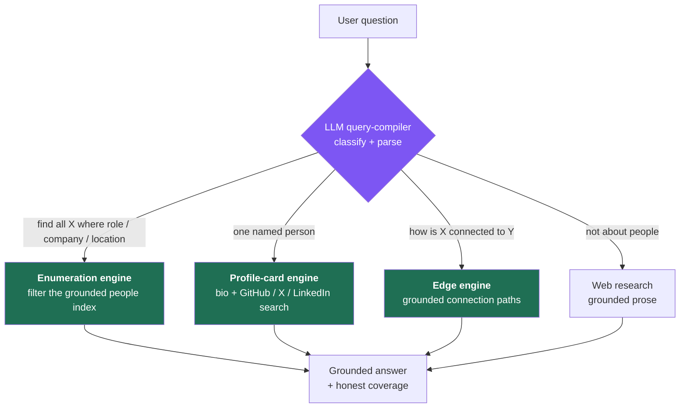
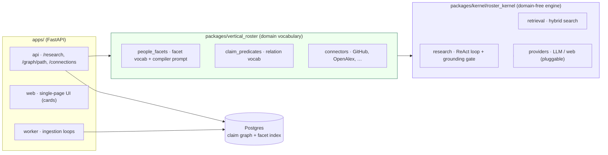
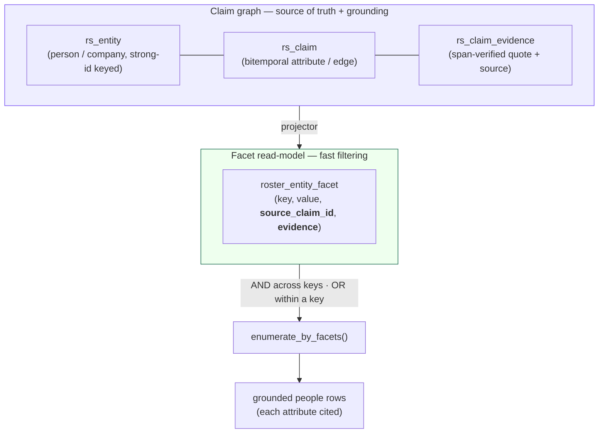
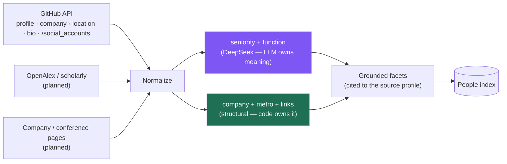
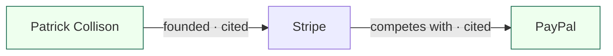

# Roster

**An AI platform for searching professionals and companies — and how they're connected.**

Roster is a *grounded* "shadow LinkedIn," reconstructed entirely from **publicly available information**
(GitHub, company pages, scholarly graphs, filings, the open web). You ask about people and companies in
plain language; Roster answers with **evidence-cited results** — every person, every attribute, every
connection tied back to a real public source. No fabrication, and it's honest about what it doesn't
know yet.

> The moat isn't a prettier answer than ChatGPT — it's **grounded, current, structured** intelligence
> you can act on: a queryable graph of who people are, where they work, and how they connect.

---

## What it can do today

| Ask | You get |
|---|---|
| *"Find all Directors/Engineering Managers in ML in the Bay Area"* | A **grounded, filterable list** — each person with role, company, and links, plus an honest coverage statement. |
| *"ML leaders at Google"* / *"who works at Apple"* / *"VPs of ML in the Bay Area"* | **Faceted graph queries** — role × function × company × location, intersected in SQL. |
| *"Sandeep Gupta who worked at Tubi, Netflix?"* | A **single-person profile card** with explicit **GitHub / X / LinkedIn** search links + a grounded bio. |
| *"How is X connected to Y?"* | A **grounded connection path** — every hop cites the evidence for that link. |

Every result card links out to the person's real profiles (GitHub, LinkedIn, X, personal site) — and
for anyone missing a direct link, a **"find on LinkedIn/X/GitHub"** search proxy so you can always reach
them.

---

## The core idea: people questions come in *classes*

The key insight is that "people questions" are not one thing. A generic web-search answers *none* of
them well. Roster **classifies** each question and routes it to a purpose-built engine:



The router uses the LLM as a **query compiler**, not a data processor: it turns
*"Directors/EMs in ML in the Bay Area"* into a structured filter
`{seniority:[director, engineering_manager], function:[machine_learning], metro:[bay_area]}` — then
**code** does the filtering against a grounded index. This is why enumeration works: you can only list
*"all X"* by filtering a population you actually hold, never by sampling a web page.

---

## Architecture

Roster is a **domain-agnostic kernel** + a single **domain vertical**, served by a vertical-neutral app.
Lineage: `noesis` → `eigen` → `roster` (the grounded-research engine is reused; the vertical is the
people/company domain).



- **Kernel** (`roster_kernel`) — the reusable, **domain-free** engine: ingestion → corpus → hybrid
  retrieval → grounded ReAct research → verbatim span-check. It names *no* domain noun (enforced by a
  conformance gate). Any vertical (legal, medical, …) could reuse it untouched.
- **Vertical** (`roster_vertical`) — *all* the people/company vocabulary: facet keys, the LLM compiler
  prompt, relation predicates, and the public-data connectors.
- **Apps** — the FastAPI service (`/research`, `/graph/path`, `/connections`), the single-page UI, and
  the ingestion worker.
- **LLM is pluggable** (`ROSTER_LLM_PROVIDER`) — currently **DeepSeek**; no embeddings provider is
  required to build or query the people graph.

---

## The grounded people graph

Roster models people as **claim-backed entities** in a bitemporal **claim graph** (the source of truth),
with a flat **facet read-model** projected on top for fast filtering. Crucially, **every facet row
carries the claim + evidence it came from** — so a facet-filtered enumeration is still fully grounded.



A facet query like *"ML directors at Apple"* becomes a SQL intersection:
`seniority=director` **AND** `function=machine_learning` **AND** `company=apple` — returning the person
entities whose grounded facets satisfy every clause, each row carrying a citation to its source profile.

---

## Where the data comes from (ingestion)

The graph is only as good as its sources, so ingestion is **structural-first** — clean, deterministic
public data — with the LLM used only where it owns *meaning* (normalizing a free-text bio into a
canonical role). This respects the project's hard rule: **code owns structure; the model owns meaning —
and meaning never gets a regex shortcut.**



- **Structural (code):** identity (a strong-id like `github:login`), company, location→metro rollup,
  and the person's other profile links (LinkedIn / X / website / Medium), pulled straight from GitHub's
  profile fields and `/social_accounts`.
- **Semantic (LLM):** the bio's **seniority** ("Machine Learning Engineering Manager @ Facebook" →
  `engineering_manager`) and **function**, canonicalized to a shared vocabulary so queries and stored
  facets match.

---

## Grounding & honesty — the non-negotiables

1. **Every fact is grounded.** No person, attribute, or edge exists without a cited public source; prose
   answers pass a verbatim span-check gate (`normalize(quote) ⊆ source`).
2. **The LLM owns meaning, code owns structure** — classification, role normalization, and intent are the
   LLM's job; filtering, joins, and citation resolution are code's. No regex heuristic ever stands in for
   a semantic decision.
3. **Coverage honesty.** "Find all X" means *"all grounded matches currently in the index"* — never
   *"everyone in the world."* Every enumeration answer states what's ingested and what isn't
   (e.g. *"180 people from public GitHub profiles; LinkedIn not yet ingested"*). An empty match is an
   **honest data gap**, never a silent fallback.
4. **Fail safe.** On ambiguity or a provider failure, Roster abstains or returns an honest gap — it does
   not guess.

---

## Connection paths (the graph, literally)

Beyond attributes, Roster answers *"how is X connected to Y?"* as a **bounded, grounded traversal** — a
path where every hop is a real edge citing its evidence.



*"How is Patrick Collison connected to PayPal?"* → **2 hops**, each hop citing a verbatim source. The
traversal is bounded (depth + degree caps) so hubs don't explode, and a path is grounded **iff every hop
is**.

---

## Tech stack

- **Python 3.13**, **FastAPI**, **Postgres** (claim graph + facet index; `tsvector` + `pgvector` for the
  corpus retrieval path), async **asyncpg** / SQLAlchemy.
- **LLM:** pluggable provider seam — currently **DeepSeek** (`ROSTER_LLM_PROVIDER=deepseek`). The people
  graph needs **no embeddings provider**.
- **Deploy:** Docker → **Railway** (one image, `api` + `worker` roles).
- **Feature flags** (default OFF, flip via env): `ROSTER_PEOPLE_POPULATION` (people engine),
  `ROSTER_EDGE_MODEL` (connection paths), `ROSTER_WEB_ONLY` (web-only retrieval).

## Repo layout

```
packages/kernel/roster_kernel/   domain-free engine (ingest → retrieve → ReAct → span-check)
packages/vertical_roster/        the people/company domain: facet vocab, predicates, connectors
apps/api/                        FastAPI — people_population.py (enumeration + profile cards),
                                 claimgraph.py (graph + facet store), graph_path.py (connection paths)
apps/web/index.html              single-page UI (people cards, profile links, coverage)
docs/specs/edge-model.md         design spec (judge-panel-reviewed)
```

## Quickstart (dev)

```bash
uv venv --python 3.13 .venv
VIRTUAL_ENV=.venv uv pip install "./packages/kernel[serve,postgres]" "./packages/vertical_roster"

# offline test suite (no DB, no network, no API keys)
ROSTER_ACTIVE_VERTICAL=roster ROSTER_PROVIDER_MODE=replay PYTHONPATH=apps \
  .venv/bin/python -m pytest packages apps/api/test_people_population.py -q
```

Config lives in `.env` (see `.env.example`): `ROSTER_LLM_PROVIDER` + key, `ROSTER_CORPUS_DSN`, and the
feature flags above.

## Status & roadmap

**Live:** grounded people enumeration (role/function/company/location) with profile links + coverage
honesty; single-person profile cards; connection paths; a seeded graph of **180 Bay-Area ML leaders**
from public GitHub profiles.

**Next:** scale ingestion (more sources: OpenAlex authors, company leadership & conference-speaker
pages); canonicalize company names (Meta / Facebook / "Meta Platforms, Inc" → one node); derive
`colleague_of` edges (shared employer + overlapping tenure); a reliable keyless web source for identity
bios.

Full design + rationale: [`docs/specs/edge-model.md`](docs/specs/edge-model.md).
