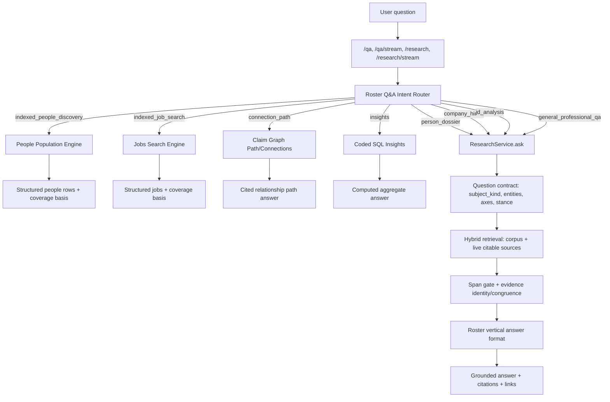

# Roster Q&A SOTA Design - Amended

Status: design draft

Related document: `docs/qa_improvements_plan.md`

## Executive Summary

The existing Q&A improvement plan is directionally correct, but it should be amended
before implementation. It fixes important blockers, especially external Eigen proxying
for `/qa` and people-population over-interception, but it does not yet define the
architecture needed for high-quality professional intelligence Q&A.

The amended design has one core idea:

> Roster Q&A should be a native, evidence-grounded router over multiple professional
> intelligence paths: people discovery, person dossiers, company hiring intelligence,
> job/JD analysis, graph connection paths, insights, and general research.

The router must preserve two truths at the same time:

1. Roster's indexed people/jobs corpus is not exhaustive. Empty indexed results are
   often a coverage statement, not permission to invent a web-sourced population.
2. Roster is an open-world Q&A product. Named people, companies, job descriptions,
   and professional background questions should fall through to native research,
   live citable sources, and graph paths when the local index is insufficient.

This document supersedes the implementation shape in `docs/qa_improvements_plan.md`
where the two conflict.

## Current Confirmed Problems

### 1. `/qa` is still an external Eigen proxy

`POST /qa` and `POST /qa/stream` are gated by `ROSTER_EIGEN_QA` and relay to an
external Eigen deployment instead of using Roster's native research stack.

Evidence:

- `apps/api/app.py:726` defines `eigen_api_url()`.
- `apps/api/app.py:2613` defines `POST /qa` as an Eigen-backed Q&A route.
- `apps/api/app.py:2661` defines `POST /qa/stream` as an Eigen SSE relay.

This is wrong for Roster because it breaks product independence, weakens local
diagnostics, and prevents Roster-specific people/jobs/graph behavior from becoming
the main Q&A experience.

### 2. `_do_research()` over-intercepts when people population is enabled

When `ROSTER_PEOPLE_POPULATION` is active, `_do_research()` sends every query to
`answer_people_population()` before native `ResearchService.ask()` can run.

Evidence:

- `apps/api/app.py:3275` starts the shared `_do_research()` core.
- `apps/api/app.py:3284` routes all questions into the people-population branch.
- `apps/api/app.py:3297` returns a single-person card without synthesis.
- `apps/api/app.py:3322` returns people-population output even when the parser said
  this is not a people query.

This makes general Q&A fail whenever the people-population flag is on.

### 3. Named person Q&A is a stub in the population path

`answer_people_population()` detects a single named person and returns a card with
GitHub, X, and LinkedIn search links. It does not synthesize a grounded person
dossier.

Evidence:

- `apps/api/people_population.py:775` builds the static profile search card.
- `apps/api/people_population.py:1017` returns `kind == "person"` for parsed single
  people.

This is useful navigation, but it is not Q&A.

### 4. People/jobs search is closed-world

People discovery and job search are backed by local structured tables. That is good
for honest indexed search, but it is not enough for broad Q&A.

Evidence:

- `apps/api/people_population.py:1079` enumerates people from local indexed facets.
- `apps/api/claimgraph.py:312` defines the `rs_job` table.
- `apps/api/claimgraph.py:329` defines the people vector table.

Closed-world behavior should remain for claims like "find people in Roster's index."
It should not block named dossiers, JD analysis, or general professional questions.

### 5. The vertical still has inherited tech/investor framing

Roster's manifest and prompts still carry deep-tech diligence and investor language.

Evidence:

- `packages/vertical_roster/roster_vertical/persona.py:11` frames the agent as a
  deep-tech intelligence analyst.
- `packages/vertical_roster/roster_vertical/answer_format.py:10` writes for an
  investor doing diligence.

This must be reshaped toward public professional intelligence: people, companies,
roles, hiring, affiliations, contributions, and connections.

## Design Goals

1. Native Roster Q&A: `/qa`, `/qa/stream`, `/research`, and `/research/stream`
   should share the same core orchestration and persistence behavior.
2. Route by intent, not endpoint accident: a question should land in the right
   professional intelligence path regardless of whether the frontend calls Q&A or
   research.
3. Preserve corpus honesty: indexed people/job enumeration must say what is and is
   not in the index.
4. Add open-world breadth safely: named entities, company hiring questions, JDs, and
   general professional questions should use bounded live sources, but every cited
   claim must remain span-verifiable.
5. Make graph connections first-class: "how is X connected to Y" is central to
   Roster and should be routed explicitly.
6. Keep the kernel domain-free: all people/company/job vocabulary belongs in the
   roster vertical or app-level router.
7. Add quantitative acceptance gates: implementation should be judged by routing,
   grounding, entity identity, coverage honesty, and answer quality evals.

## Non-Goals

- Do not scrape LinkedIn or other login-walled/profile walled-garden pages.
- Do not make the kernel know about jobs, candidates, recruiters, employers, resumes,
  LinkedIn, or professional networks.
- Do not turn zero-result indexed people search into unbounded web search that
  pretends to enumerate the world.
- Do not replace existing people/jobs structured search endpoints with prose-only
  answers.
- Do not launch broad prod ingest or eval sweeps without explicit budget approval.

## Target Architecture



## Router Contract

Create one app-level router function that classifies the question before the
people-population short-circuit:

```python
class QaRoute(BaseModel):
    route: Literal[
        "indexed_people_discovery",
        "indexed_job_search",
        "person_dossier",
        "company_hiring",
        "jd_analysis",
        "connection_path",
        "insights",
        "general_professional_qa",
        "clarify",
    ]
    subject_kind: Literal["person", "company", "job", "relationship", "general", ""]
    entities: list[str]
    axes: list[str]
    confidence: Literal["high", "medium", "low"]
    clarification: str = ""
```

The router lives in `apps/api/`, not the kernel. It may call existing LLM parsers
and existing deterministic signals, but its output must be persisted in diagnostics
when diagnostics are enabled.

### Routing Matrix

| User intent | Route | Primary engine | Fallback |
| --- | --- | --- | --- |
| "Find people with X skill in Y city" | `indexed_people_discovery` | `answer_people_population()` | Coverage gap, not broad web enumeration |
| "Who is Jane Doe?" | `person_dossier` | `ResearchService.ask()` with deep-person reader | Clarify on ambiguous names |
| "What is Databricks like as a hiring company?" | `company_hiring` | `ResearchService.ask()` with deep-company reader | General professional Q&A |
| "Analyze this JD / this job URL" | `jd_analysis` | JD source materialized as citable source + `ResearchService.ask()` | Ask for pasted JD if URL fetch fails |
| "How is X connected to Y?" | `connection_path` | claim graph path + cited synthesis | Native research if graph lacks both entities |
| "How many people in index are ex-Stripe founders?" | `insights` | coded SQL/graph aggregate | Honest abstain if unsupported |
| "Explain the market for AI infra recruiters" | `general_professional_qa` | native research | Clarify if too broad |

### Important Routing Rules

1. `not_people_query == True` must fall through to native research.
2. `kind == "person"` from `answer_people_population()` must not return the static
   card as the whole answer. It should become `person_dossier`, optionally attaching
   profile links as secondary UI material.
3. Zero results for a faceted people discovery question should usually remain a
   people-index coverage gap. It should not become web enumeration unless the user
   explicitly asks to search the open web beyond Roster's index.
4. Connection questions should try the graph first when both endpoints resolve.
5. If the router has low confidence between a person and a company, ask a clarifying
   question instead of spending live-source calls on a likely wrong subject.

## Native `/qa` and Streaming Behavior

Replace the Eigen proxy routes with thin wrappers over the native pipeline.

### `/qa`

`POST /qa` should:

1. Validate the question.
2. Call the same routing/orchestration used by `_do_research()`.
3. Return the same shape the frontend expects:
   `{answer, claims, grounded, coverage_gaps, source}`.
4. Persist as `kind="qa"` for compatibility with existing history.
5. Set `source="roster"`.

### `/qa/stream`

`POST /qa/stream` should:

1. Use the same `_SSE_RUNS` buffering path as `/research/stream`.
2. Emit a `run` event immediately.
3. Emit router progress events such as `route`, `people`, `graph`, `retrieving`,
   `verifying`, and `composing`.
4. Emit a `final` event with the same payload as `/qa`.
5. Persist exactly once after the run completes, regardless of client disconnects.

Do not duplicate the research-stream runner. Factor common streaming behavior if the
current route shape makes that easy; otherwise keep wrappers minimal.

## ResearchService Alignment

The original plan mentions mode overrides such as `person_dossier`,
`company_hiring`, and `jd_analysis`. Those are not native `ResearchService.ask()`
modes today.

The amended design should map routes to existing service inputs:

| Route | Service mechanism |
| --- | --- |
| `person_dossier` | Ensure question contract emits `subject_kind="person"` and one entity; deep-person reader fires in `run_react()` |
| `company_hiring` | Ensure question contract emits `subject_kind="specific_entity"` and one entity; deep-company reader fires; append hiring-specific vertical directive |
| `jd_analysis` | Add a per-request citable JD retrieval source; use `answer_format_override` or `extra_directive` |
| `general_professional_qa` | Standard `ResearchService.ask()` with roster persona/format |
| `connection_path` | Graph path engine, then optional `ResearchService` synthesis over graph citations |

Evidence:

- Deep readers are already wired into `ResearchService` at `apps/api/app.py:1590`.
- Deep readers fire in `packages/kernel/roster_kernel/research/react.py:1434` and
  `packages/kernel/roster_kernel/research/react.py:1447`.
- The service already supports `extra_directive`, `answer_format_override`, `kind`,
  and question contracts in `packages/kernel/roster_kernel/runtime/research.py`.

## Entity Resolution and Disambiguation

Add an entity-resolution phase before expensive deep retrieval for:

- common human names;
- company/product ambiguity;
- GitHub handles vs real names;
- employers with old/new names;
- people whose current role differs from older public sources;
- companies with similar names;
- pasted JDs where employer is inferred from URL or text.

Minimum resolver output:

```python
class ResolvedSubject(BaseModel):
    entity_type: Literal["person", "company", "job", "unknown"]
    display_name: str
    canonical_id: str = ""
    aliases: list[str] = []
    evidence: list[dict] = []
    confidence: Literal["high", "medium", "low"]
    ambiguity: list[dict] = []
```

Rules:

1. High confidence: proceed.
2. Medium confidence: proceed only if the question contains enough disambiguating
   context, and surface the assumed identity.
3. Low confidence or multiple plausible subjects: ask a clarifying question.
4. Never merge claims across possible people with the same name.
5. Every resolved identity claim shown to the user must have evidence or be labeled
   as the router's assumption.

## Citable Source Materialization

The span gate only works when a cited quote can be reloaded from the source's block
loader. The design must specify this for every new live source.

Existing web retrieval already follows this pattern:

- `packages/kernel/roster_kernel/retrieval/web.py:84` defines `WebRetrievalSource`.
- `packages/kernel/roster_kernel/retrieval/web.py:105` exposes a per-search block
  loader.
- `packages/kernel/roster_kernel/research/provenance.py:44` verifies quoted spans.

New sources must follow the same interface.

### JD and ATS Source

Create an app-level or vertical-level JD materialization layer that converts:

- pasted JD text;
- public job URLs;
- fetched Greenhouse/Lever/Workday/ASHBY/etc. pages where legally and technically
  accessible;
- already-indexed `rs_job` rows;

into citable chunks with:

- `document_id`;
- `block_id`;
- exact text;
- `Locator(kind="block_span", ref={"block_id": block_id})`;
- facets such as `source_kind="job_posting"`, `employer`, `title`, `location`,
  `posted_at`, `valid_as_of`, `source_url`, and `self_reported=True`.

If a JD URL cannot be fetched or produces only boilerplate, ask the user to paste the
JD rather than hallucinating role requirements from the title.

### GitHub Source

GitHub evidence should distinguish:

- profile README or bio text;
- repositories owned by the person;
- repositories contributed to by the person;
- organization membership only when public and explicit;
- commit/contribution metrics only when present in fetched text or API data.

Every GitHub claim must be grounded in a citable text block. Derived metrics should
come from structured API responses materialized into text blocks or fact-coordinate
locators, not model estimates.

### Profile and Search Snippet Source

LinkedIn/X should remain links or search-indexed snippets only. Do not scrape
login-walled pages. If a claim comes from a search snippet, label it as snippet-level
evidence and do not treat it as a verified profile fact.

## Vertical Roster Prompt and Answer Contracts

Replace the inherited tech/investor voice with a professional-intelligence voice.

### Persona

The persona should become:

> A careful public professional-intelligence analyst who answers questions about
> people, companies, jobs, affiliations, professional history, contributions, and
> connections using public evidence.

Authority hierarchy:

1. Statutory and regulatory records: company registries, SEC filings, official
   corporate filings.
2. Official first-party pages: company team pages, job posts, engineering blogs,
   personal sites, GitHub profiles, publication profiles.
3. Structured third-party records: Wikidata, OpenAlex, Crossref, Semantic Scholar,
   YC, reputable company directories.
4. Independent reporting: reputable press, interviews, podcasts, talks.
5. Community and market signals: forums, social, Hacker News, Reddit, search snippets.

Rules:

- Separate official/self-reported claims from independent corroboration.
- Separate current claims from stale claims.
- Separate a person's own description from third-party evidence.
- Never infer employment, seniority, credentials, or affiliation without evidence.
- Never present market/social sentiment as fact.
- Never provide hiring or candidate recommendations as if private data is known.

### Answer Formats

Define route-specific answer formats in `packages/vertical_roster/roster_vertical/`.

`PERSON_DOSSIER_FORMAT`:

- Bottom line.
- Identity and current affiliation.
- Career history.
- Work and contributions.
- Public professional footprint.
- Collaborators and connections.
- Evidence gaps and ambiguity.

`COMPANY_HIRING_FORMAT`:

- Bottom line.
- What the company builds.
- Hiring signal and open roles.
- Engineering/product areas.
- Tech stack and architecture evidence.
- Leadership and team signals.
- Evidence gaps and stale-source warnings.

`JOB_DESCRIPTION_FORMAT`:

- Role summary.
- Must-have requirements.
- Nice-to-have requirements.
- Leveling and seniority signals.
- Tech/domain areas.
- Interview/preparation implications.
- Evidence gaps.

`CONNECTION_PATH_FORMAT`:

- Direct answer.
- Path summary.
- Per-hop evidence table.
- Strength of connection.
- Missing or ambiguous links.

The app router should select these through `extra_directive`,
`answer_format_override`, or contract-compose profiles, without adding domain nouns to
the kernel.

## Graph Connection Q&A

Graph questions are first-class:

- "How is X connected to Y?"
- "Who connects X and Y?"
- "Who has worked with X?"
- "What companies is this person connected to?"
- "Who at company A also worked at company B?"

The route should:

1. Resolve both endpoints.
2. Query existing graph path/neighbor functions.
3. Return a cited relationship answer when paths exist.
4. Fall through to native research only when graph coverage is missing or endpoints
   cannot resolve.
5. Preserve graph coverage honesty: no path means "no path in Roster's graph yet,"
   not "no relationship exists."

Existing surfaces to reuse:

- `apps/api/app.py:2423` for `/graph/path`.
- `apps/api/app.py:2460` for `/connections`.

## People and Jobs Corpus Semantics

Keep the people/jobs corpus strict and honest.

### People Discovery

For faceted discovery questions, return people rows only from the index. Include:

- query facets;
- country/geo scope;
- number of indexed people;
- source document count;
- relaxed filters if any;
- not-yet-ingested source classes;
- per-person citation with quote/tier when available.

Do not web-search arbitrary people to fill a result set unless the UI and answer
explicitly say this is an open-web search, not a Roster-index result.

### Jobs Search

For job search questions, return indexed jobs when the user is searching jobs.
For JD analysis, analyze the supplied or fetched JD as citable evidence.

Do not answer "open roles at X" from stale indexed rows without `valid_as_of` or
`updated_at` disclosure.

## Evidence Fitness and Claim Congruence

The existing span gate proves that a quote exists. SOTA Q&A needs additional
identity and evidence-kind checks.

For people/company/job answers, enforce or evaluate:

- Subject congruence: the evidence is about the same person/company/job.
- Evidence kind congruence: a self-reported bio does not prove independent career
  validation; a job post proves stated requirements, not actual team practice.
- Time congruence: role, employer, and job-posting claims should include dates or
  "as of" disclosures when available.
- Source strength: official, registry, structured third-party, independent reporting,
  social/snippet.

The answer should disclose when important facts rest only on weak evidence.

## Rollout Plan

### Phase 0 - Lock the contract with tests

Add tests before changing behavior:

- `/qa` no longer calls Eigen and returns `source="roster"`.
- `/qa/stream` uses native SSE and emits final native payload.
- `not_people_query=True` falls through to native research.
- named-person parse does not return only the static profile card.
- zero-match faceted people discovery remains a coverage gap.
- graph connection questions route to graph path when endpoints resolve.
- JD URL or pasted text becomes citable block evidence.

### Phase 1 - Native Q&A wrappers

Replace `/qa` and `/qa/stream` proxying with wrappers over the native router and
research/persistence stack.

### Phase 2 - Router and fallthrough

Introduce `QaRoute` and use it before the people-population short-circuit.

Minimum routes:

- `indexed_people_discovery`;
- `person_dossier`;
- `company_hiring`;
- `jd_analysis`;
- `connection_path`;
- `general_professional_qa`;
- `clarify`.

### Phase 3 - Vertical prompt and answer contracts

Update `persona.py`, `answer_format.py`, `person_reader.py`, and `company_reader.py`.
Add `jd_reader.py` if JD-specific source materialization and directives need their
own vertical-owned vocabulary.

### Phase 4 - Citable JD/profile source materialization

Add JD source materialization and make GitHub/profile materialization explicit.
Ensure every new source has a loader that can support `BlockSpanVerifier`.

### Phase 5 - Graph Q&A

Wire `connection_path` route into the main Q&A surface. Add synthesis over graph
paths only if the hop citations remain visible and auditable.

### Phase 6 - Eval suite and scenario harness

Create vertical gold cases for professional Q&A and track them separately from
inherited tech cases.

### Phase 7 - UI copy and mobile verification

Update `apps/web/index.html` copy, examples, error messages, and mobile behavior.
Verify at <=400px width for any user-facing Q&A changes.

## Evaluation Plan

The amended eval plan must include both deterministic route tests and quality evals.

### Deterministic Acceptance Tests

1. Native `/qa`:
   - no outbound Eigen call;
   - `source="roster"`;
   - persisted as `kind="qa"`.

2. Native `/qa/stream`:
   - returns run event;
   - emits progress;
   - final payload matches non-stream response shape;
   - persists once.

3. People-population fallthrough:
   - non-people query reaches `ResearchService.ask()`;
   - single named person reaches dossier path;
   - true faceted people discovery remains local-index search;
   - zero local matches disclose coverage gap.

4. Graph routing:
   - "how is X connected to Y" resolves endpoints and calls graph path;
   - no graph path returns graph coverage gap, not universal no-relationship claim.

5. JD grounding:
   - pasted JD text is chunked into citable blocks;
   - fetched JD URL is chunked into citable blocks;
   - answer claims cite exact JD spans;
   - inaccessible URL asks for pasted text.

### Held-Out Quality Evals

Add 50 to 100 curated cases across:

- person dossier;
- ambiguous person/name collision;
- company hiring intelligence;
- job description analysis;
- relationship path;
- people discovery;
- jobs search;
- general professional Q&A.

Each case should define:

- expected route;
- allowed entities;
- forbidden entities;
- expected claims or values;
- expected source tiers;
- required coverage gaps;
- citation requirements;
- freshness expectations;
- adversarial decoys.

### Adversarial Cases

Minimum adversarial set:

- common-name person where search results mix multiple people;
- company with same name as another company;
- person self-bio claiming a role not corroborated elsewhere;
- stale job posting;
- old role vs current role conflict;
- job title without JD text;
- social/snippet-only claim;
- graph path absent despite likely real-world connection;
- wrong-company funding or hiring attribution;
- "find all" query where the local index is incomplete.

## Success Criteria

Implementation should not be considered complete until:

1. `/qa` and `/qa/stream` are native Roster routes.
2. People-population no longer blocks general Q&A.
3. Named-person questions produce grounded dossiers or clarification, not only search
   links.
4. Company hiring questions use company reader plus hiring-specific answer contracts.
5. JD questions cite the JD text or ask for it.
6. Connection questions use graph paths when available.
7. Zero-result people discovery remains honest about index coverage.
8. The vertical persona and answer formats no longer read as investor-only tech
   diligence.
9. New route and grounding tests pass.
10. A professional-Q&A eval set exists with baseline scores before broad rollout.

## Open Implementation Questions

1. Should `/research` and `/qa` become exact aliases, or should `/qa` remain a
   compatibility wrapper that always persists `kind="qa"`?
2. Should open-web people discovery be a separate explicit route and UI mode?
3. Which source APIs are acceptable for structured professional data beyond open web
   and existing connectors?
4. Should graph answers be composed by the LLM, or initially returned as structured
   path cards with minimal prose?
5. Should JD materialization live in `apps/api/` because it is request-input handling,
   or in `packages/vertical_roster/` because ATS/JD vocabulary is vertical-owned?

## Recommended First Implementation Slice

The smallest useful slice is:

1. Add route tests for native `/qa`, fallthrough, named-person dossier routing, and
   zero-match people coverage.
2. Replace `/qa` and `/qa/stream` with native wrappers.
3. Add an app-level route classifier with only four routes:
   `indexed_people_discovery`, `person_dossier`, `connection_path`, and
   `general_professional_qa`.
4. Make `not_people_query` and named-person responses fall through correctly.
5. Update existing tests that currently lock in the static person-card behavior.

That slice will fix the biggest broken Q&A behavior without pretending the whole
SOTA stack is done.
