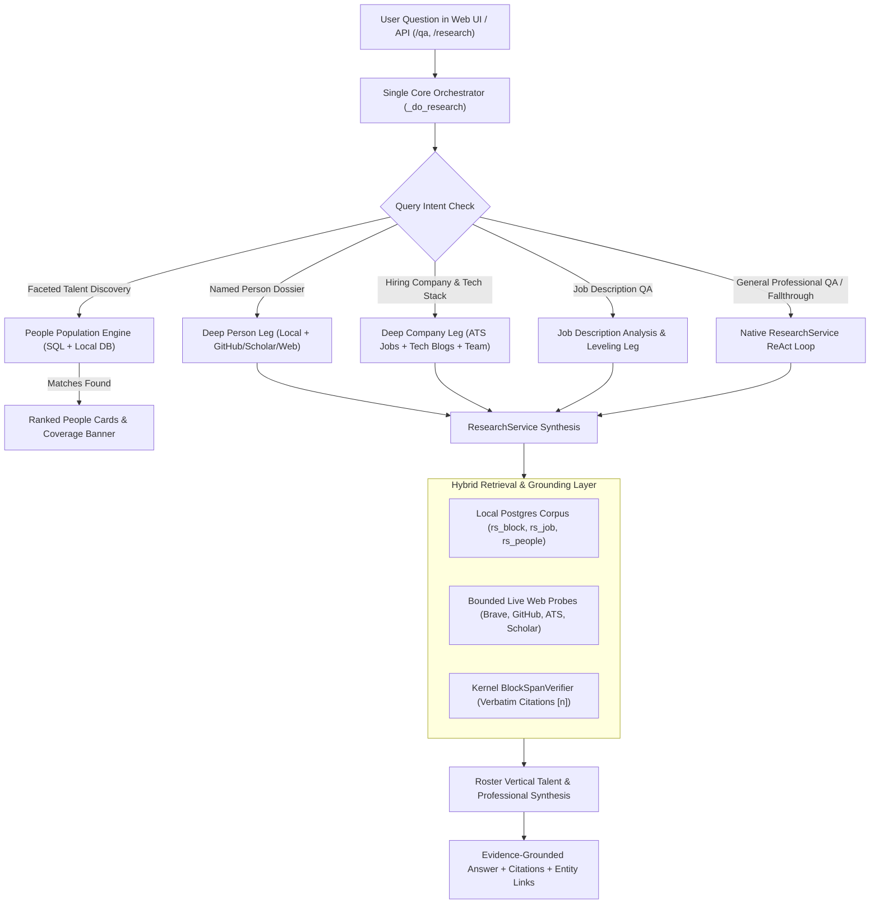

# Q&A Functionality Examination & Implementation Plan (Post-Review Refined)

## Executive Summary & Diagnostic Findings

Roster was conceived as a **"shadow LinkedIn" and professional intelligence platform** reconstructed from public sources (company registries, filings, code hosts, scholarly graphs, career pages, and the open web). Following an architectural examination and independent peer review (via Codex CLI and a code-grounded auditor), we identified the root causes limiting its Q&A functionality:

### Core Architectural Bottlenecks Identified

1. **Decoupled External Proxying for Q&A (`/qa` and `/qa/stream`)**:
   - In [`apps/api/app.py:2613-2730`](file:///Users/sgupta/roster/apps/api/app.py#L2613-L2730), `POST /qa` and `POST /qa/stream` proxy outbound requests to an external `ROSTER_EIGEN_API_URL` service.
   - When the external service is unconfigured or unavailable, Q&A fails with 404 or `"Couldn't reach Eigen"`.
   - The `/insights` endpoint is restricted to SQL `GROUP BY` counts on local DB tables, abstaining on all qualitative questions.

2. **Over-Interception & Missing Fallthrough in `_do_research`**:
   - In [`apps/api/app.py:3275-3325`](file:///Users/sgupta/roster/apps/api/app.py#L3275-L3325), when `ROSTER_PEOPLE_POPULATION` is active, `_do_research()` intercepts **all** queries and calls `answer_people_population()`.
   - If a question is about a named individual (`kind == "person"`), it calls `build_person_profile_card` ([`people_population.py:775`](file:///Users/sgupta/roster/apps/api/people_population.py#L775)), returning **only 3 dummy search URLs** (GitHub, X, Google/LinkedIn) with zero bio, career background, or synthesis.
   - Even when `answer_people_population()` determines `not_people_query=True`, `_do_research()` fails to fall through to `ResearchService.ask()`, returning an empty people-style message instead of running the research pipeline.

3. **Closed-World Database Constraint vs. Open-World Needs**:
   - Talent discovery and job queries strictly query local PostgreSQL tables (`rs_people_attributes`, `rs_job`).
   - When an entity or role is not in the seed database, the system returns an empty result instead of dynamically executing bounded, multi-leg web and API searches (Brave, GitHub, ATS boards, OpenAlex, EDGAR, Wikidata).

4. **Domain Mismatch in Vertical Persona & Prompts (`roster_vertical`)**:
   - The vertical manifest [`roster_vertical/manifest.py`](file:///Users/sgupta/roster/packages/vertical_roster/roster_vertical/manifest.py) and persona [`roster_vertical/persona.py`](file:///Users/sgupta/roster/packages/vertical_roster/roster_vertical/persona.py) still carry the inherited VC/investor diligence framing (SEC 10-Ks, USPTO patents, arXiv papers).
   - It lacks first-class prompt directives and answer formats for:
     - **People Dossiers**: Career history, technical contributions, open-source work, publications, affiliations.
     - **Hiring Companies**: Engineering culture, tech stack, open roles, team structure, hiring velocity.
     - **Job Descriptions**: Role requirements breakdown, leveling expectations, comparison between roles.

---

## Target Architecture

---

## Key Refinements from Codex & Auditor Panel

1. **Single Core Orchestrator (No Redundant Engines)**:
   - Make `/qa` and `/qa/stream` thin wrappers over `_do_research` and the native SSE stream, preserving session persistence, SSE resumption buffers, and diagnostics without code duplication.
2. **Clean Fallthrough in `_do_research`**:
   - `_do_research` only short-circuits for true faceted people discovery where local matches exist.
   - Single-person dossier queries, company queries, JD queries, and `not_people_query=True` queries cleanly fall through to `ResearchService.ask()` with the appropriate vertical contract mode.
3. **Strict Domain-Free Kernel Boundaries**:
   - Keep `packages/kernel/roster_kernel/` 100% domain-free (zero nouns like `candidate`, `recruiter`, `job`, `career`).
   - `deep_person.py` and `deep_company.py` in the kernel remain generic template expanders; all domain templates and prompts live strictly in `packages/vertical_roster/roster_vertical/`.
4. **Typed `BlockHit` Grounding for Live Sources**:
   - Ensure every live source (ATS text, GitHub profiles, JD text, web pages) is converted into a `BlockHit` with a `Locator(kind="block_span", ...)` before synthesis so that every claim is verified by the kernel's verbatim span gate.
5. **Purge Remaining Medical Artifacts**:
   - Remove legacy medical placeholders (e.g. `type 2 diabetes`, NPI inputs, DICOM upload copy) from `apps/web/index.html` and clean test fixtures in `apps/api/test_api.py`.

---

## Proposed Changes by Component

### 1. Vertical Domain Layer (`packages/vertical_roster/roster_vertical/`)

#### [MODIFY] [persona.py](file:///Users/sgupta/roster/packages/vertical_roster/roster_vertical/persona.py)
- Refactor `TechPersona` system prompt from VC diligence to a **Talent, Professional, and Company Intelligence Analyst** ("Shadow LinkedIn").
- Establish evidence hierarchy separating verified records (filings, registries, code repos, publications) from self-reported claims (bios, company marketing, blog posts) and market signals.

#### [MODIFY] [answer_format.py](file:///Users/sgupta/roster/packages/vertical_roster/roster_vertical/answer_format.py)
- Define specialized answer formats:
  - `PERSON_DOSSIER_FORMAT`: Summary, Current Role & Affiliations, Career History, Key Contributions (Code/Papers/Patents), Collaborators/Network, Grounded Citations.
  - `COMPANY_HIRING_FORMAT`: Overview & Product, Tech Stack & Architecture, Active Hiring & Open Positions, Team Leadership, Engineering Culture.
  - `JOB_DESCRIPTION_FORMAT`: Role Summary & Mission, Must-Have vs Nice-to-Have Requirements, Tech Stack, Leveling/Seniority Expectations, Preparation Strategy.

#### [MODIFY] [person_reader.py](file:///Users/sgupta/roster/packages/vertical_roster/roster_vertical/person_reader.py)
- Expand query templates for person dossier retrieval to cover: current role, career history, GitHub/code contributions, papers/publications, talks/interviews, and professional network.

#### [MODIFY] [company_reader.py](file:///Users/sgupta/roster/packages/vertical_roster/roster_vertical/company_reader.py)
- Expand query templates for company hiring intelligence: engineering blog/tech stack, open jobs/careers, team leadership, hiring focus, and engineering culture.

#### [NEW] [jd_reader.py](file:///Users/sgupta/roster/packages/vertical_roster/roster_vertical/jd_reader.py)
- Templates and prompts for fetching, parsing, analyzing, and comparing job descriptions from URLs or pasted text.

#### [MODIFY] [manifest.py](file:///Users/sgupta/roster/packages/vertical_roster/roster_vertical/manifest.py)
- Expose the new persona, readers, answer formats, and contract modes in `build_manifest()`.

---

### 2. API & Routing Layer (`apps/api/`)

#### [MODIFY] [app.py](file:///Users/sgupta/roster/apps/api/app.py)
- **Native `/qa` & `/qa/stream`**: Remove outbound `httpx` proxying to Eigen; route `/qa` and `/qa/stream` through `_do_research` and the native SSE stream (`_sse_runs`).
- **Fallthrough in `_do_research`**:
  - If `answer_people_population()` returns `kind == "person"` or `not_people_query == True` or 0 matches, pass the query into `ResearchService.ask()` with the appropriate mode override (`person_dossier`, `company_hiring`, `jd_analysis`, or standard research).
- **Purge legacy medical branches** in `_resolve_audience` and `clinical_synthesis`.

#### [MODIFY] [people_population.py](file:///Users/sgupta/roster/apps/api/people_population.py)
- Update `parse_people_facets` and `answer_people_population` so single-person queries signal the need for deep dossier synthesis rather than returning a static 3-link stub.

---

### 3. Web UI Layer (`apps/web/`)

#### [MODIFY] [index.html](file:///Users/sgupta/roster/apps/web/index.html)
- Clean up legacy medical placeholder text (e.g. `type 2 diabetes`, NPI inputs, DICOM upload copy).
- Update search and Q&A suggestions to reflect people, hiring companies, tech stacks, and job descriptions.
- Verify mobile responsiveness at `<= 400px` viewport width.

---

## Verification Plan

### Automated Tests
1. **Vertical Persona & Format Tests**:
   - `PYTHONPATH=apps:packages/vertical_roster:packages/kernel .venv/bin/python -m pytest packages/vertical_roster/roster_vertical/ -q`
2. **Native Q&A & Research Tests**:
   - `PYTHONPATH=apps:packages/vertical_roster:packages/kernel .venv/bin/python -m pytest apps/api/test_api.py -q`
   - `PYTHONPATH=apps:packages/vertical_roster:packages/kernel .venv/bin/python -m pytest apps/api/test_deep_person_reader.py -q`
   - `PYTHONPATH=apps:packages/vertical_roster:packages/kernel .venv/bin/python -m pytest apps/api/test_deep_company_reader.py -q`
   - `PYTHONPATH=apps:packages/vertical_roster:packages/kernel .venv/bin/python -m pytest apps/api/test_people_population.py -q`
3. **Kernel Invariant & Conformance Guardrails**:
   - `.venv/bin/python tools/check_kernel_imports.py`
   - `bash tools/check_kernel_invariant.sh`

### Manual & Scenario Verification
1. **Named Person Dossier**: *"Who is Greg Brockman and what are his contributions at OpenAI and Stripe?"* -> Verify structured dossier with career history, GitHub/projects, papers, and grounded citations.
2. **Hiring Company Intel**: *"Tell me about Databricks as a hiring company - what are they building, what is their tech stack, and what open roles do they have?"* -> Verify structured company brief with tech architecture, active hiring, and open roles.
3. **Job Description Analysis**: *"Explain the requirements and expectations for a Staff Machine Learning Infrastructure Engineer role at an AI startup"* -> Verify structured requirements breakdown, leveling insight, and fit advice.
4. **Talent Discovery with Broad Fallback**: *"Find distributed systems engineers in Seattle with Raft/consensus experience"* -> Verify grounded candidate discovery.
