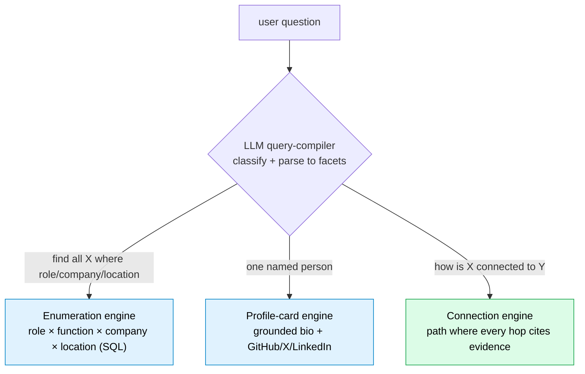

# Roster: A "shadow LinkedIn" from public data — where every fact has a citation

*Repo: https://github.com/4sgupta828/roster · grounded people + company graph · reconstructed from public sources · a citation for every person, attribute, and connection*

---

## The industry problem

Recruiters, founders, BD, and investors all need the same thing: *find the right people, understand how they're connected, and know it's true.* Today's tools force a bad trade:

| Tool | The catch |
|---|---|
| LinkedIn | A walled garden; not queryable, not yours |
| Data brokers | Stale, opaque enrichment with no provenance |
| General chatbots | Will invent a plausible bio, a job, or a connection — confidently, with zero sources |

For people-data, **a confident fabrication isn't a glitch; it's the entire risk.**

## Framed as a research problem

| | |
|---|---|
| **Core insight** | "People questions" are not one thing — they're *classes*, and a single web-search answers none well |
| **Approach** | An LLM query-compiler *classifies* intent and routes to a purpose-built engine |
| **Grounding rule** | Every person, attribute, and edge ties back to a real public source — or it doesn't ship; honest about coverage gaps |
| **The moat** | Not a prettier answer than ChatGPT — **grounded, current, structured** intelligence you can act on |

## Classify → route



```text
"VPs of ML in the Bay Area"
  → compiler: {role: VP, function: ML, location: Bay Area}
  → faceted graph query (intersection in SQL)
  → grounded list + an HONEST coverage statement ("here's what I found; here's what I don't know yet")
```

## What AI solves — and where code must own it

| Task | Owner |
|---|---|
| Parse messy intent → structured facets ("VPs of ML" → role × function) | **LLM** (query-compiler) |
| Reconcile the same person/company across noisy public sources | **LLM + code** (canonicalization) |
| Enumerate, intersect, and build connection paths | **SQL + graph** — not hallucinated prose |
| Attach a real source to every claim | **Code** (grounding gate) |

## What stays genuinely hard (open problems)

1. **Entity resolution at scale** — same name, different people; same person, five profiles. This is the classic **record-linkage** problem and it's *the* hard core of people-data.
2. **Coverage honesty** — the hardest UX is saying "here's what I found, and here's what I don't know yet" instead of fabricating to fill the gap.
3. **Freshness & ethics** — public data changes; building on it responsibly (public-only, consent-aware, honest) is a first-class constraint, not an afterthought.

## How to take it from here

- Treat the people/company **graph** as the durable asset; every surface (search, profile, connections) is a *view* over it.
- Grounded, **coverage-driven retrieval** so a *sample* never silently becomes "the answer."
- **Provenance on every edge**, so a connection path is auditable end to end.

## Use cases → products

| Use case | Product shape |
|---|---|
| Sourcing / recruiting | Grounded candidate lists where every fact is cited |
| BD & fundraising | Relationship intelligence ("who do we know who knows them — and why do we believe it") |
| Enrichment | A public-data API that ships *sources*, not just fields |

## To understand this space better

Entity resolution / **record linkage** · knowledge-graph construction · hybrid retrieval · the people-data landscape (Clearbit, Apollo, People Data Labs) — then ask what changes when *every fact must cite a public source.*

---

*The winning people-search product isn't the one with the most data — it's the one where every fact is grounded, current, and honest about its gaps.*

**#KnowledgeGraphs #EntityResolution #Recruiting #DataEngineering #AI #PeopleAnalytics #ProductManagement**
