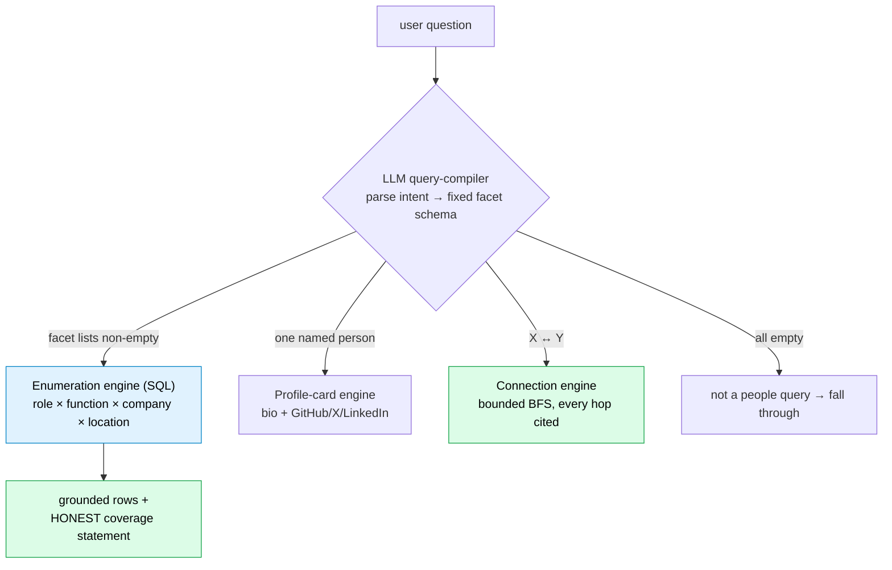

# Roster: A "shadow LinkedIn" from public data — where a false merge is the enemy and every fact has a citation

*Repo: https://github.com/4sgupta828/roster · a grounded people + company graph · bitemporal claim store · every person, attribute, and edge cites a public source*

> **TL;DR for anyone building on people/company data:** The hard part of grounded people-search isn't the answer — it's two compounding correctness problems. (1) A generative model will happily invent a plausible-but-fake person, employer, or connection, and "find all X" can't be answered by sampling a web page at all — *there is no page listing them.* (2) The same company arrives from five sources under five names, and a single **false merge** silently collapses two real companies into one and corrupts every downstream count. Roster's answer: the LLM is a *query compiler*, not a data source; SQL and a bitemporal claim graph produce every answer; and entity resolution is engineered to **never merge on ambiguity**, because keeping two entities separate is always safe and a false merge is not.

---

## 1. The problem, in the language of a data buyer

Recruiters, founders, BD, and investors all need the same thing: *find the right people, understand how they connect, and know it's true.* Today's tools force a bad trade — LinkedIn is a walled garden, brokers sell stale enrichment with no provenance, and general chatbots fabricate confidently with zero sources.

For people-data, **a confident fabrication isn't a glitch; it's the entire risk.** And underneath sits the load-bearing correctness problem nobody markets: **entity resolution.** Same name, different people. Same company, five spellings. Get it wrong in the "safe" direction (leave two records unmerged) and you have duplicates. Get it wrong in the *unsafe* direction (merge two real companies) and every headcount, every connection, every count is now silently poisoned — and it's unrecoverable.

## 2. The thesis: LLM as compiler, code as answer

The core insight is that **"people questions" come in classes**, and a single generic search answers none of them well. So an LLM parses intent into a *fixed, closed-schema* facet object, and deterministic SQL/graph code produces the answer.



*"VPs of ML in the Bay Area"* → the compiler emits `{seniority:[vp], function:[machine_learning], metro:[bay_area]}` (expanding group-words like "leaders" into a *set* of seniority levels, canonicalizing "Facebook"→`meta` at query time, and *dropping* ranking words like "top" because SQL returns unranked). Then the enumeration engine turns that into one SQL statement — **AND across facet keys, OR within a key** — using a count-of-distinct-matched-keys trick to implement set intersection over a grounded read-model. The LLM never touches the population; code never guesses meaning.

## 3. Grounding is structural — enforced in SQL, not in a prompt

The **claim graph is the source of truth**; a flat facet read-model is projected on top for fast filtering. Every fact is a bitemporal, append-only **claim** with 1..N evidence rows (document, block, verbatim quote, authority tier). Crucially, reads use an **INNER LATERAL join on `evidence_status = 'active'`**, so a claim with no live supporting span *never surfaces*, and the citation returned is that claim's highest-authority evidence. Delete a source block and its evidence flips to `'stale'` (never deleted) — the answer simply drops until re-extracted. Grounding isn't a checkbox; it's a join condition.

Claim extraction itself is three **fail-closed** gates: (1) the predicate must be in the active registry; (2) the quote must pass a verbatim substring span-check — byte-identical to the read-time gate, so a quote passing here also passes later; (3) an entailment judge must confirm the quote supports `<subject> <predicate>: <object>`. Fail any gate → dropped, never laundered.

## 4. The record-linkage core: engineered to never merge on ambiguity

This is where the real research problem lives. Company/person names normalize to a structural key by stripping a **27-token set of legal suffixes** (`inc, llc, ltd, corp, gmbh, plc, …`), so `Acme, Inc.` and `Acme LLC` collapse to `acme`. Strong IDs (domain, SEC CIK, slug) use a *different* normalization — no suffix stripping — because a domain's dots are opaque tokens you must not corrupt.

Resolution is an ordered pipeline, and its safety invariant is the whole point:

```
resolve_entity(mention):
  1. STRONG-ID match (domain / cik / slug)      → resolve outright
  2. EXACT-NORM match: exactly 1 → resolve; 0 → new node; >1 → AMBIGUOUS
  3. AMBIGUOUS → LLM same-entity judge, per candidate
       merge ONLY IF (same == True AND confidence >= 0.8) to EXACTLY ONE candidate
       else → park a mention / mint a flagged 'unresolved_candidate' for human review
# no LLM · judge error · unconfident · confident-same to TWO → NEVER a merge
```

And a subtle, important rule: **a person's name is not an identity.** Namesakes are real, so a bare-name exact-norm hit *never* auto-merges a person — only a strong ID or an evidence-based judgment resolves them. Conflicting claims for one `(subject, predicate)` are resolved by an explicit precedence — *controlling evidence → authority tier → confidence → recency* — and the **losers are never retracted**; they stay queryable. "Who we believed, and when" is auditable.

## 5. Decisions and tradeoffs

| Decision | Alternative rejected | What we gave up | Why |
|---|---|---|---|
| LLM-as-compiler | LLM-as-answerer | The fluency of letting the model just answer | "You can only list all X by filtering a population you hold, never by sampling a web page" |
| Never merge on ambiguity | Aggressive merging for higher recall | Fewer duplicate nodes | A false merge collapses two real companies and is unrecoverable; keeping them separate is always safe |
| Person-name ≠ identity | Treat name as a key | Auto-resolution convenience | Namesakes; only a strong ID or evidence resolves a person |
| Grounded-only | Fabricate to fill gaps | Coverage, completeness | Fabrication destroys the moat; a claim with no verbatim quote is dropped |
| Coverage honesty | Imply completeness | Looking comprehensive | "Find all X" = "all grounded matches in the index"; every answer states what's *not* ingested |
| Bitemporal, append-only graph | Mutable rows | Storage simplicity | Auditability + reproducibility; losers stay queryable |
| Public-data-only + `dry_run` default | Proprietary data, unconstrained extraction | Richer data, speed | Ethics + shared-credit safety; cost caps abort *before* any LLM call |

## 6. The AI-vs-deterministic-code boundary

| Concern | Owner |
|---|---|
| Intent → facets (role/function synonyms, group-word expansion, sector-vs-field) | **LLM** (compiler) |
| Faceted intersection (AND/OR), citation resolution, coverage counts | **SQL / graph** |
| Same-entity judgment *on genuine ambiguity only* | **LLM** (≥0.8 confidence, else don't merge) |
| Strong-id / exact-norm lookup, winner ordering, writes | **code** |
| "Does this quote exist in this block?" | **code** (substring gate) |
| Company/metro/links/identity at ingest | **code** (structural); seniority/function → **LLM** |

The rule, verbatim from the codebase: *the LLM owns meaning, code owns structure — and meaning never gets a regex shortcut.*

## 7. How we know it works

- **Provenance hard gate:** `normalize(quote) in normalize(block_text)`, fail-closed on a missing/out-of-scope block, tenant-isolated by construction (the cross-tenant false-pass guard).
- **Semantic grounding gate:** a *different-model-family* judge flags any composed span asserting something no verified claim supports.
- **Coverage metrics in every answer:** persons indexed, distinct source documents, per-facet coverage counts — folded into a population statement, so "we know it works" means the answer states exactly what's ingested vs. missing.
- **39 integration test files** in the API alone — split into offline (replay-mode, no DB/network/keys) and DSN-gated tests against real Postgres — covering the strong-id→exact-norm→ambiguous ER chain, the never-merge fail-safe with persisted flags, and controlling-evidence conflict resolution with losers kept queryable.

## 8. What stays genuinely hard (open problems)

1. **Entity resolution at scale** — node-level company canonicalization (merging Meta / Facebook / "Meta Platforms, Inc." into one graph node) is still the frontier; today the alias is handled at query time.
2. **Coverage honesty as a permanent frontier** — the seed index is ~180 Bay-Area ML leaders from public GitHub; "find all" is only ever "all grounded matches in the index," and every answer must keep restating that.
3. **Scale-driven architecture tension** — reads must be indexed SQL only; the in-process graph snapshot caps ~20k rows and is *banned* at 1–2M entities (target: ~1.27M physicians). Pairwise "colleague" edges are *never* materialized — a large hospital would explode the table.
4. **Freshness & ethics** — public-data-only by design; evidence goes stale (never deleted) when sources vanish; sensitive fields carry honest status flags and right-of-reply, never silent deletion.

## 9. How to take it from here

- Node-level entity resolution as a first-class pipeline (not just query-time aliases).
- Derive relationship edges (shared employer + overlapping tenure) without materializing the O(N²) table.
- Grow coverage while keeping the coverage statement honest — the index expands, the humility doesn't shrink.

## 10. Use cases → products

| Use case | Product |
|---|---|
| Sourcing / recruiting | Grounded candidate lists where every fact is cited |
| BD & fundraising | Relationship intelligence — "who do we know who knows them, and why do we believe it" |
| Enrichment | A public-data API that ships *sources*, not just fields |

## 11. To understand the space

Entity resolution / **record linkage** · knowledge-graph construction (bitemporal, append-only) · hybrid retrieval · the people-data landscape (Clearbit, Apollo, People Data Labs) — then ask what changes when *every fact must cite a public source and a false merge is the cardinal sin.*

---

*The winning people-search product isn't the one with the most data — it's the one where every fact is grounded, current, and honest about its gaps, built on an entity resolver that refuses to guess.*

**#KnowledgeGraphs #EntityResolution #RecordLinkage #Recruiting #DataEngineering #AI #PeopleAnalytics #ProductManagement**
