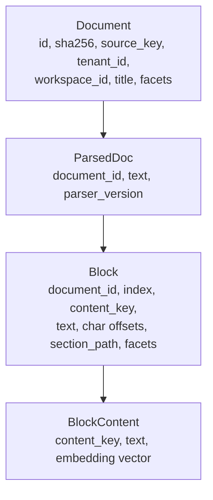

# 01 · Architecture

← [Back to README](README.md) · Next: [02-ingestion](02-ingestion.md)

This doc explains the single most important decision in Noesis — the
**kernel/vertical split** — and then walks the layer stack top to bottom so you
know where every kind of code lives.

---

## 1. The kernel/vertical split, and why it exists

Imagine you built a great medical-research engine. Now your boss says "do the
same for legal research." A naive codebase would have `if domain == "medical"`
branches and medical vocabulary (`condition`, `drug`, `NCT number`) smeared
through the search, ranking, and answer code. Porting means a scary rewrite.

Noesis refuses that fate with one rule: **the kernel may never learn a domain
word.** The kernel deals only in generic shapes — documents, blocks, facets,
locators, claims. A *vertical* is a separate installable package that teaches
the kernel exactly one domain by handing it domain-shaped objects that fit
generic sockets.

```
packages/
  kernel/noesis_kernel/          ← domain-FREE. Knows nothing about medicine.
  vertical_medical/              ← the medical domain, as a plugin
apps/
  api/                           ← the FastAPI app that wires it all together
```

The contract between them is a set of Python `Protocol`s — structural interfaces
— in [`contract/protocols.py`](../packages/kernel/noesis_kernel/contract/protocols.py).
A `Protocol` is like a Java interface, except a class satisfies it just by having
the right methods (no `implements` keyword needed). They are all
`@runtime_checkable` so the system can assert a vertical actually conforms
(`protocols.py:20`, `:31`, `:56`, `:72`, etc.).

Read the module docstring — it states the philosophy directly:

> "a new domain (financial, legislative) is added purely by shipping a package
> that satisfies these Protocols — zero kernel edits. … Nothing here names a
> domain concept; the vocabulary is always the vertical's `facets`/`scope`/typed
> `extra`." — `protocols.py:1-9`

### The sockets a vertical plugs into

| Protocol | File:line | What the vertical supplies |
|----------|-----------|----------------------------|
| `Connector` | `protocols.py:31` | How to discover entities, list documents, and fetch raw bytes from a source (FAERS, ClinicalTrials.gov, …). |
| `Parser` | `protocols.py:47` | `content_type → text`. Kernel ships plain-text + HTML; verticals add PDF/XBRL. |
| `RetrievalSource` | `protocols.py:56` | A searchable corpus. Must expose `search()`, `covers()`, and `make_block_loader()` (the last is what the provenance gate verifies against). |
| `GatingPolicy` | `protocols.py:72` | Domain-neutral seam for coverage/gating decisions. |
| `Persona` | `protocols.py:106` | The system prompt + tool descriptions. |
| `UIContract` / `EntityView` | `protocols.py:123` / `:113` | *Declared* UI (nav, facets, columns) so the app shell renders any vertical with zero app edits. |
| `CitationVerifier` | `protocols.py:96` | Extra provenance paths beyond `block_span` (e.g. XBRL cell coordinates). |
| `ScopeRouter` | `protocols.py:86` | *Optional* cross-source arbitration. |

All of these are collected into one object — the
[`VerticalManifest`](../packages/kernel/noesis_kernel/contract/manifest.py) — which
is "the single object a vertical package exposes" (`manifest.py:1`). The medical
one is assembled in `vertical_medical/.../manifest.py:31` (`build_manifest()`).

### How the app finds the vertical

A deployment activates **exactly one** vertical. The kernel discovers installed
verticals through Python's entry-point mechanism (`build.py:63`,
`load_active_vertical()`): it looks up the `roster.verticals` entry-point group
and picks the one named by the `ROSTER_ACTIVE_VERTICAL` environment variable
(`build.py:68-75`). So switching a deployment to another vertical is an
env var + a `pip install`, not a code change.

> **Why `Protocol`s instead of base classes?** Structural typing means the
> vertical never has to import a kernel base class and inherit from it. It just
> ships plain objects with the right method names. This keeps the dependency
> arrow pointing one way (vertical → kernel) and makes conformance checkable at
> runtime rather than enforced by inheritance.

---

## 2. The anti-anchor: facets instead of columns

Here is the trick that makes domain-freedom actually hold. A medical document is
"about" a condition, has a source kind, comes from a country. A naive schema
would give the `Document` table columns named `condition`, `source_kind`,
`country`. The moment those columns exist in the kernel, the kernel knows about
medicine.

Instead every domain dimension is stored in a **generic `facets` bag** — a plain
`dict[str, str]` — defined in
[`contract/dto.py:16`](../packages/kernel/noesis_kernel/contract/dto.py):

```python
Facets = dict[str, str]   # dimension → value, opaque to the kernel
```

The vertical decides that the key `"source_kind"` means something and the value
`"drug_label"` is meaningful. The kernel only ever does `facets.get(k)` or
"does this hit's facets satisfy this filter?" (`dto.py:6-7`). A **facet filter**
on a query (`FacetFilter`, `dto.py:21`) maps each dimension to one required value
*or* a set of acceptable values (`region in {north, south}` semantics). This is
the seam that lets the medical vertical add country-scoping
(`source_country`) later without the kernel ever learning what a country is.

> The docstring says it best: facets exist "so that porting an algorithm from a
> domain-specific system can never smuggle domain-specific column names into the
> kernel." — `dto.py:1-8`

---

## 3. The core data model

The corpus "spine" is four content-addressed shapes in
[`corpus/models.py`](../packages/kernel/noesis_kernel/corpus/models.py):



- **`Document`** (`models.py:15`) — one fetched artifact. `sha256` is the
  content key of the raw bytes; `tenant_id` is the hard isolation boundary;
  `workspace_id` is `None` for the shared corpus or set for a user's private
  "bring your own documents" scope (`models.py:20-22`). Carries `facets`.
- **`ParsedDoc`** (`models.py:30`) — the extracted text (markdown/plain) plus the
  parser version, so re-parsing is reproducible.
- **`Block`** (`models.py:37`) — a paragraph-sized chunk. Its `content_key` is the
  **sha256 of the block text** (`models.py:41`), which is what makes identical
  passages across documents deduplicate to one stored copy. It can carry its own
  per-block `facets` that merge *over* the document's (`models.py:47`).
- **`BlockContent`** (`models.py:51`) — the deduplicated block text plus its
  embedding vector. Keyed by `content_key`, so one embedding per unique passage.

### The production index: `rs_block`

At query time the corpus doesn't live as those Python objects — it lives as one
flat Postgres table, `rs_block`, whose DDL is in
[`retrieval/postgres.py:27-46`](../packages/kernel/noesis_kernel/retrieval/postgres.py).
It denormalizes the whole join into one row per block:

```sql
CREATE TABLE rs_block (
    tenant_id       text NOT NULL,
    workspace_id    text,
    document_id     text NOT NULL,
    block_id        text NOT NULL,
    text            text NOT NULL,
    tsv             tsvector GENERATED ALWAYS AS (to_tsvector('english', text)) STORED,
    embedding       vector(1536),          -- pgvector
    facets          jsonb NOT NULL DEFAULT '{}',
    document_title  text, content_type text, source_key text,
    PRIMARY KEY (tenant_id, document_id, block_id)
);
```

Three indexes make hybrid search fast (`postgres.py:43-45`): a **GIN** index on
`facets` (fast JSONB filtering), a **GIN** index on the `tsv` tsvector (lexical /
keyword search), and an **HNSW** index on the `embedding` (approximate nearest
neighbor for dense/semantic search). We'll see how all three are used in
[03-answering](03-answering-questions.md).

### The Locator: how a claim points at evidence

The provenance gate needs to answer "where does this quote live?" That address is
a [`Locator`](../packages/kernel/noesis_kernel/contract/dto.py) (`dto.py:48`):

```python
@dataclass(frozen=True)
class Locator:
    kind: str          # "block_span" | "fact_coordinate" | "row_cell" | "registry_row" | "url"
    document_id: str
    ref: dict          # opaque; the matching verifier understands it
```

The kernel owns the `block_span` kind (a quote inside a text block); the
`ref` dict just carries `{"block_id": ...}` (`postgres.py:205`). Other kinds are
verticals' territory. `kind` is the dispatch key that routes a claim to the right
verifier (`dto.py:52-56`).

### The BlockHit and the RetrievalRequest

- A **`BlockHit`** (`dto.py:63`) is a retrieved chunk of evidence — text, score,
  facets, its `locator`, and `source_key` (which source produced it). It's what
  flows out of retrieval and becomes an *atom* in the research loop.
- A **`RetrievalRequest`** (`dto.py:83`) is a query. Crucially, `tenant_id` and
  `workspace_id` are "a FIRST-CLASS, mandatory boundary (security — never a soft
  facet)" (`dto.py:84-87`). The `query_embedding` is supplied by the kernel's
  embedder so a source never re-embeds (`dto.py:88`). `k` is how many results to
  return; `fetch_pool` is the per-leg candidate pool before fusion.

---

## 4. The layer stack

Read the kernel bottom-up and each layer only depends on the ones below it:

```
┌─────────────────────────────────────────────────────────────┐
│ apps/api          FastAPI: /research, /research/stream,       │  the outside world
│                   /config, /ingest, /search, sessions, media  │
├─────────────────────────────────────────────────────────────┤
│ runtime/          ResearchService.ask (research.py),          │  wires providers +
│                   ingest_connector_to_postgres (ingest.py),   │  sources + vertical
│                   build.py (provider + vertical discovery)     │
├─────────────────────────────────────────────────────────────┤
│ research/         react.py (the ReAct loop), provenance.py    │  the answer engine
│                   (the gate), atoms, budget, claims_first,     │
│                   fallback_grounder, suggest, gap_planner,     │
│                   vision, explain, precision                   │
├─────────────────────────────────────────────────────────────┤
│ retrieval/        postgres.py, memory.py, multi.py,           │  find evidence
│                   dispatch.py (multi-query), rank.py,          │
│                   fusion.py (RRF), scoring.py, web.py          │
├─────────────────────────────────────────────────────────────┤
│ corpus/ +         models, repository, parsers, splitter;      │  the corpus spine +
│ ingestion/        pipeline.py (discover→…→embed), storage,     │  getting evidence in
│                   materialize, queue, s3_storage               │
├─────────────────────────────────────────────────────────────┤
│ contract/         protocols.py (the sockets), dto.py (the      │  the plugin contract
│                   shapes), manifest.py (the vertical bundle)   │
├─────────────────────────────────────────────────────────────┤
│ providers/        llm.py, embeddings.py, anthropic_llm,        │  external services,
│                   openai_llm, web (tavily/exa), cassette       │  cassette-wrapped
└─────────────────────────────────────────────────────────────┘
```

### `providers/` — external services, always cassette-wrapped

Every provider (LLM, embeddings, web search) is wrapped in a **cassette**
(`build.py:29-60`). A cassette records real API responses to disk and can replay
them offline for free. The mode is chosen by `ROSTER_PROVIDER_MODE`
(`build.py:5-6`): `replay` (default — offline, deterministic, zero credits),
`record`, or `live`. This is why the *same* code path serves CI, local dev, and
production; credits are opt-in. The LLM port itself
([`providers/llm.py:31`](../packages/kernel/noesis_kernel/providers/llm.py)) is a
tiny `Protocol` — one async `complete(system, messages, response_format)` method
that returns a **structured** Pydantic object. Because the LLM port is
structured-output, the ReAct loop needs no bespoke tool-use protocol (see
`react.py:6-10`).

### `runtime/` — the composition root

[`runtime/research.py`](../packages/kernel/noesis_kernel/runtime/research.py)
defines `ResearchService` (`research.py:20`): a dataclass holding an LLM, an
embedder, a dict of named `RetrievalSource`s, the vertical's gating policy, and
all the vertical prompts (persona, answer_format, vision, layman, gap, suggest).
Its `ask()` method (`research.py:60`) is the single entry point the API calls; it
assembles attachment/history context and calls `run_react`. This is where the
kernel and the active vertical finally meet.

The app builds a `ResearchService` in
[`apps/api/app.py:build_default_service`](../apps/api/app.py) (around
`app.py:183-241`): load the active vertical → build cassette-wrapped providers →
if a `ROSTER_CORPUS_DSN` is set, create a `PostgresRetrievalSource` under the
vertical's corpus key, else fall back to the in-memory fixture corpus
(`app.py:186-201`) → add a `web` source → thread each vertical prompt in
**only if its feature flag is on** (`app.py:207-238`).

---

## Surprises worth flagging

- **The vertical never touches the database schema.** `rs_block` is entirely
  kernel-owned (`postgres.py:27`). The vertical's only influence on stored data
  is the opaque `facets` JSONB. That is the whole discipline working.
- **`workspace_id IS NULL` is meaningful, not missing.** A `NULL` workspace means
  "shared tenant-wide corpus"; a set one means a private document scope. The
  query builder treats them differently (`postgres.py:143-146`) — a search always
  sees the shared corpus *plus* the requested workspace.

Next: [how evidence gets into the corpus →](02-ingestion.md)
