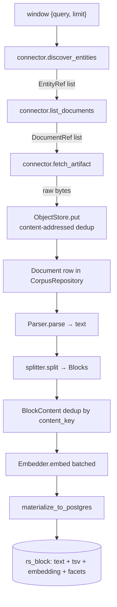
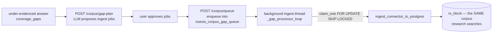

# 02 · Ingestion — how evidence gets into the corpus

← [01-architecture](01-architecture.md) · [Back to README](README.md) · Next: [03-answering](03-answering-questions.md)

Before Noesis can answer anything, it needs a searchable body of evidence. This
doc traces one document's journey from a remote API to a searchable row in
Postgres, then covers the medical connectors, deduplication, facets, and the
prod-direct gap-fill queue.

---

## 1. The pipeline in one line

```
discover entities → list documents → fetch raw bytes → parse to text
→ split into blocks → embed each block → materialize into rs_block (Postgres)
```

Everything before "materialize" is **domain-neutral kernel code**; the only
domain-specific piece is the **Connector** that knows how to talk to one remote
source. Let's walk each stage.



---

## 2. The Connector — the only domain-aware piece

A `Connector` (the Protocol at `contract/protocols.py:31`) exposes three async
methods:

```python
async def discover_entities(self, window: dict) -> list[EntityRef]
async def list_documents(self, entity: EntityRef) -> list[DocumentRef]
async def fetch_artifact(self, doc: DocumentRef) -> bytes
```

An **entity** is "a thing a source is about" — a clinical trial, a drug, an
adverse-event report (`dto.py:24-33`). A **document** is a fetchable artifact
belonging to zero or more entities (`dto.py:35-45`). The `window` dict carries a
`query` and a `limit` — this is how a gap-fill job says "fetch 200 trials about
glioblastoma."

The connector's *entire* job is source-specific selectors/API mapping +
normalization; "scheduling/storage/retries/breaker belong to the kernel"
(`protocols.py:32-35`). Crucially, all the domain nouns live in the returned
refs' `facets`/`extra` — never in the method signatures. That's the discipline
that keeps the kernel domain-free.

---

## 3. Stage 1 — `ingest_source`: discover → fetch → store → document

The kernel driver is
[`ingestion/pipeline.py:ingest_source`](../packages/kernel/noesis_kernel/ingestion/pipeline.py)
(`pipeline.py:34-66`). For each discovered entity it lists documents, fetches
each artifact's raw bytes, and stores them:

```python
raw = await connector.fetch_artifact(ref)
key = store.put(raw)                      # content-addressed: key = sha256(raw)
doc = Document(id=f"{ref.source_key}:{ref.native_id}", sha256=key, ...)
repo.upsert_document(doc)
```

Two dedup mechanisms appear here:

- **Object store dedup.** `store.put(raw)` returns a content key = sha256 of the
  bytes; storing identical bytes twice stores them once (`pipeline.py:22`,
  `objects_stored` counts only unique bytes actually stored).
- **Document dedup.** `repo.upsert_document` (`repository.py:33-39`) keys on
  `sha256`; re-ingesting identical bytes reuses the existing row. The document's
  stable `id` is `"{source_key}:{native_id}"` (`pipeline.py:52`) — e.g.
  `"clinicaltrials:NCT00841061"`. **Remember this format** — it is exactly what
  the medical vertical's `source_url` parses back apart to build a citation link
  ([04-medical](04-medical-vertical.md)).

---

## 4. Stage 2 — `index_document`: parse → block → embed

Next, [`index_document`](../packages/kernel/noesis_kernel/ingestion/pipeline.py)
(`pipeline.py:69-105`) turns raw bytes into searchable blocks.

**Parse.** The `ParserRegistry` (`corpus/parsers.py:15`) dispatches by
`content_type`. The kernel ships a `PlainTextParser` (`parsers.py:34`) and a
stdlib-only `HtmlParser` that strips `<script>`/`<style>` and keeps text
(`parsers.py:41-66`). Heavier parsers (PDF via docling, XBRL) register the same
`Parser` Protocol without kernel edits (`parsers.py:1-7`). Notice the medical
connectors sidestep PDF entirely: they synthesize clean **markdown** from
structured API JSON, so the plain-text parser suffices.

**Split.** [`splitter.split`](../packages/kernel/noesis_kernel/corpus/splitter.py)
(`splitter.py:25`) is a deterministic paragraph splitter. It walks blank-line
boundaries, tracks a markdown-heading stack as a `section_path`, and — this is
the key line — sets each block's `content_key` to the **sha256 of the block
text** (`splitter.py:74`, via `content_key(...)`). Deterministic + versioned
(`SPLITTER_VERSION = "para.v1"`, `splitter.py:13`) means re-splitting the same
text yields byte-identical blocks, so identical passages across documents share
one `content_key` and dedup.

**Embed.** For each *new* block content (by `content_key`), the embedder turns
text into a vector (`pipeline.py:96-104`). The clever bit is deferral: pass
`embedder=None` to `index_document` and it just registers the blocks; then one
batched pass over the whole corpus embeds everything at once via
[`embed_pending`](../packages/kernel/noesis_kernel/ingestion/pipeline.py)
(`pipeline.py:108-120`). This turns "one API call per document" into
"O(blocks / batch_size) calls" — a large cost/latency win when ingesting
hundreds of documents.

> **Why content-addressed everything?** Two reasons. (1) Dedup: the same FDA
> boilerplate paragraph appearing in 500 drug labels is embedded once. (2)
> Stable citation targets: a `block_id` is the hash of its text, so a claim's
> locator survives re-ingestion as long as the text is unchanged.

---

## 5. Stage 3 — `materialize_to_postgres`: into the searchable index

The in-memory corpus is now joined into flat `rs_block` rows by
[`materialize_to_postgres`](../packages/kernel/noesis_kernel/retrieval/materialize.py)
(`materialize.py:41-68`). For every block it computes the final facet set:

```python
facets = {**doc.facets, **block.facets, **ov}   # materialize.py:58
```

That is: the **document's** facets, overlaid by any **per-block** facets, overlaid
last by **`facet_overrides`** (`ov`). Rows are upserted in batches of 500
(`materialize.py:41`) via `PostgresRetrievalSource.upsert_blocks`
(`postgres.py:102-125`), one round-trip per batch.

The whole connector→postgres path is wrapped in one runtime function,
[`ingest_connector_to_postgres`](../packages/kernel/noesis_kernel/runtime/ingest.py)
(`ingest.py:19-50`): it runs `ingest_source`, parses+blocks every doc (deferring
embedding), runs one batched `embed_pending`, ensures the schema, and
materializes. **This one function is what the API's `/ingest` and the gap
processor both call.**

---

## 6. Facets — the tagging system that makes scoping possible

A facet is a `dimension → value` tag on a block ([01-architecture §2](01-architecture.md)).
The two most important system-level facets, both set by the medical connectors:

- **`source_kind`** — what *type* of evidence this is: `"drug_label"`,
  `"adverse_event"`, `"article"`, `"public_health"`, `"study_type"`. This lets a
  query (or the admin coverage report) reason about evidence composition.
- **`source_country`** — which country's evidence this is. Medical connectors set
  it deliberately: openFDA/FAERS/DailyMed/CDC → `"US"` (US regulatory/public
  health); ClinicalTrials.gov and Europe PMC → `"global"` (international
  literature/registry). See `faers.py:37`, `openfda.py:47`, `dailymed.py:38`,
  `cdc.py:35`, `trial_doc.py:39`, `europepmc.py:57`.

`source_country` is the seam behind **country-scoping** (a flag, default off).
When on, a request can filter to `{"source_country": (picked, "global")}`
(`app.py:76-86`) — always including `"global"` so international literature is
never excluded. The `facet_overrides` argument is how a country-specific ingest
run stamps *every* block it produces: e.g. an India-specific job passes
`facet_overrides={"source_country": "IN"}` (`app.py:281`), so those blocks are
retrievable under India scope even though the connector didn't know about
countries.

> **Surprise / trap flagged in the code:** `country_scope_enabled()` warns it
> must *not* be flipped on in prod until *every* block carries a `source_country`
> — otherwise a scoped query silently excludes all the legacy NULL-country blocks
> and returns empty (`app.py:64-69`). This is the "expand the data before you
> enforce the filter" discipline.

### How the facet filter is enforced

At query time, `PostgresRetrievalSource._filter_sql` (`postgres.py:139-153`)
turns the request's `facets` into SQL predicates: `(facets ->> $key) = ANY($vals)`
— a **hard filter** using the GIN-indexed JSONB column. Tenant and workspace are
also hard predicates here (`postgres.py:140-146`) — never soft facets, because
they are the security isolation boundary.

---

## 7. The medical connectors and what each covers

Six connectors are registered in the medical manifest (`vertical_medical/.../manifest.py:36-44`).
All share the same shape (`discover_entities` → `list_documents` → `fetch_artifact`),
fetch over plain datacenter HTTP with no proxy, and are fixture-injectable so they
run offline in tests.

| Connector (`key`) | Source | What it covers | Key facets set |
|-------------------|--------|----------------|----------------|
| **clinicaltrials** (`connector.py:14`) | ClinicalTrials.gov v2 API | Trial registrations — design, phase, outcomes, eligibility. Synthesized into one markdown doc per NCT by `trial_doc.to_markdown` (`trial_doc.py:55`). | `study_type`, `status`, `phase`, `condition`, `intervention`, `country`, `year`, `source_country="global"` (`trial_doc.py:26-52`) |
| **openfda** (`openfda.py:12`) | FDA Structured Product Labels (`drug/label.json`) | Official drug labels: indications, dosing, warnings, contraindications, adverse reactions, interactions (6 sections, `openfda.py:14-21`). | `generic`, `brand`, `route`, `product_type`, `manufacturer`, `source_kind="drug_label"`, `source_country="US"` (`openfda.py:39-49`) |
| **dailymed** (`dailymed.py:9`) | DailyMed SPLs (NLM, ~158k labels) | Most-current prescribing info; NLM-authoritative complement to openFDA (same SPL source). | `source_kind="drug_label"`, `source_country="US"` only — **no drug-name facets** (`dailymed.py:37-38`) |
| **faers** (`faers.py:12`) | openFDA FAERS adverse-event reports (20M+) | Real-world safety signals: suspect drug + reaction + seriousness + date. | `source_kind="adverse_event"`, `source_country="US"`, `serious`, `generic`, `year` (`faers.py:35-43`) |
| **europepmc** (`europepmc.py:12`) | Europe PMC (PubMed/MEDLINE/PMC) | Primary literature — abstracts always; OA full text opt-in. | `source_kind="article"`, `source_country="global"`, `source_db`, `open_access`, `year`, `journal`, `pub_type` (`europepmc.py:55-69`) |
| **cdc** (`cdc.py:12`) | CDC data.cdc.gov catalog (Socrata) | Public-health datasets (incidence/prevalence/trends); dataset-level metadata today. | `source_kind="public_health"`, `source_country="US"`, `year` (`cdc.py:34-37`) |

Notable details:

- **Europe PMC full-text is opt-in** via `ROSTER_EPMC_FULLTEXT` (default off,
  `manifest.py:39-40`). When on, it appends OA JATS-XML body text (capped at
  35k chars, `europepmc.py:14`) only for open-access articles, and fails safe to
  the abstract on any XML error (`europepmc.py:25-52`). This matters for recall:
  effect sizes and confidence intervals often live in the full text, not the
  abstract.
- **DailyMed bulk ingest needs a query.** Without a `drug_name`, the endpoint
  returns only page 1, so every bulk job would fetch the *same* labels
  (`dailymed.py:28-30`). A subtle correctness trap the code calls out.
- **RxNorm is NOT a connector.** `rxnorm.py` is a utility that maps a drug name
  → canonical RxCUI so the same drug links across trials/labels/papers/adverse
  events (`rxnorm.py:4-6`). It is defined but **not currently wired into ingest
  facets** (`coverage.py:17`) — an example of built-but-dormant capability.

The declared coverage roadmap lives in
[`coverage.py`](../packages/vertical_medical/noesis_vertical_medical/coverage.py):
`SOURCE_INVENTORY` (`coverage.py:10-19`) and ~85 `COVERED_CONDITIONS`
(`coverage.py:23-99`) grouped by therapeutic area, each ingested "deep" (~300
trials + ~150 papers). This is plain declared data surfaced at
`GET /admin/coverage`.

---

## 8. The prod-direct gap-fill queue

Here is one of the most interesting operational designs. When an answer is
under-evidenced, the system can *heal its own corpus* — and it does so **directly
in production**, never local-then-push (a deliberate policy shift recorded in the
project memory).

The flow (all flag-gated behind `ROSTER_GAP_HEALING`, default off):



- **Planning** (`/corpus/gap-plan`, `app.py:588-612`) calls
  `ResearchService.plan_gaps` → `gap_planner.plan_gap_fill`
  (`research/gap_planner.py:43`). The LLM proposes `{connector, query, limit}`
  jobs, but the kernel **hard-validates**: drops any job naming a connector not
  in the available set, and clamps every `limit` to `[1, 400]`
  (`gap_planner.py:70-72`). The model owns *what to fetch*; code owns *what's
  allowed*.
- **Queueing** (`/corpus/queue`, `app.py:614-645`) writes approved jobs into the
  `noesis_corpus_gap_queue` table
  ([`apps/api/gap_queue.py`](../apps/api/gap_queue.py), schema at
  `gap_queue.py:16-37`).
- **Processing** happens on a **dedicated daemon thread** with its own asyncio
  event loop (`app.py:244-284`), so the heavy connector-fetch + blocking OpenAI
  embed never stalls the API's serving loop. It claims jobs atomically with
  `FOR UPDATE SKIP LOCKED` (`gap_queue.py:92-99`) so multiple replicas never
  double-run a job, reclaims stale `running` jobs older than 20 minutes
  (crash/redeploy recovery, `gap_queue.py:40`, `88-91`), and on completion the
  new blocks land in the **same** `rs_block` table that research searches
  (`app.py:278-282`). A failed job records its error and the loop continues
  (`app.py:283-284`).

There is also a bulk admin entry point, `POST /admin/corpus/ingest`
(`app.py:659-710`, guarded by an `X-Admin-Token`), which expands a list of
conditions into clinicaltrials + europepmc jobs and drugs into faers jobs, and
can stamp a batch-level `source_country` — this is how a whole therapeutic area
or an India-specific corpus gets ingested in one call.

> **Three Postgres tables, one DSN.** `rs_block` (evidence),
> `noesis_research_session` (Q&A threads + videos), and
> `noesis_corpus_gap_queue` (ingest jobs) all share `ROSTER_CORPUS_DSN`. Each
> store is **vertical-isolated** (bound to one vertical, every query scoped by
> it) and every write is **best-effort** — a persistence failure must never break
> `/research` (`sessions.py:8-11`, `gap_queue.py:8`).

---

## Surprises worth flagging

- **The corpus starts empty.** A fresh deploy with a DSN has a real
  `PostgresRetrievalSource` but zero rows until something ingests (`app.py:191-198`).
  Without a DSN, the app falls back to a tiny in-memory **fixture corpus** — the
  medical one is just *2 sample trials* built through the real pipeline
  (`source.py:25-45`). That's enough for the offline eval, not for real answers.
- **openFDA and DailyMed both cite the DailyMed page.** Both key on the SPL
  `setid`, so `links.source_url` maps both to DailyMed (`links.py:36-37`).
- **FAERS findings have no clickable source** — there's no clean per-report page,
  so `source_url` returns `None` for FAERS (`links.py:45-46`).

Next: [how a question becomes a grounded answer →](03-answering-questions.md)
