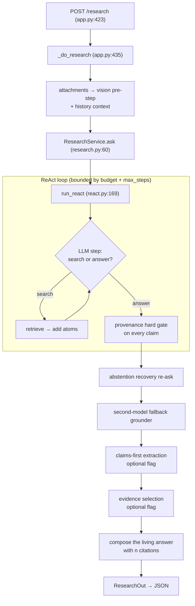

# 03 · Answering a question, end to end

← [02-ingestion](02-ingestion.md) · [Back to README](README.md) · Next: [04-medical-vertical](04-medical-vertical.md)

This is the heart of Noesis. A question comes in as an HTTP request; a grounded,
citation-bearing answer goes out. Along the way the system searches, reasons,
verifies every quote against its source, recovers from abstention, optionally
mines every passage for more, ranks the survivors, and writes prose. We'll follow
the whole path and then zoom into each mechanism.

Primary file:
[`research/react.py`](../packages/kernel/noesis_kernel/research/react.py) (the
ReAct loop) and
[`runtime/research.py`](../packages/kernel/noesis_kernel/runtime/research.py)
(the service that calls it).

---

## 1. The 30,000-foot view



Every box after "provenance hard gate" is a *recovery or enrichment* stage that
can only ever *add span-verified claims* — none of them can weaken the gate. Keep
that framing: **the gate is the one immovable object; everything else bends
around it to maximize recall without ever letting a fabrication through.**

---

## 2. Before the loop: the ask() setup

[`ResearchService.ask`](../packages/kernel/noesis_kernel/runtime/research.py)
(`research.py:60-125`) does three things before delegating to `run_react`:

1. **Vision pre-step.** If images are attached and the vertical supplies a
   `vision_prompt`, it calls `observe_images` (`research.py:80-87`) to produce a
   *labeled visual description*. This is context only — never evidence. A failed
   vision read is swallowed so it can't break research (`research.py:86-87`).
2. **Attachment + history context.** Uploaded document text and prior
   conversation turns are packed into `attachment_context` and `history_context`
   (`research.py:88-108`). Both frame the search but are deliberately kept out of
   the question string *and* the compose step.
3. **Source split.** `_split_retriever` (`research.py:48-58`) separates the
   **corpus** sources (searched with multi-query fusion) from **aux** sources
   like `web` (queried once per step). More on why below.

Then it calls `run_react` and returns an `AnswerResult`.

> **A hard epistemic boundary:** the loop injects image/document/history context
> with an explicit label — "NOT corpus evidence … NEVER cite it as a source"
> (`react.py:225-241`). This is why an uploaded PDF can *guide* a search without
> ever appearing as if it were a verified corpus finding. The attachment can
> shape the question but can never *be* the answer.

---

## 3. The ReAct loop, step by step

"ReAct" = **Rea**son + **Act**: the model alternates between acting (searching)
and reasoning (deciding whether it has enough to answer). Each iteration the LLM
returns a structured `AgentStep` (`react.py:56-61`):

```python
class AgentStep(BaseModel):
    action: Literal["search", "answer"]
    query: str | None = None
    queries: list[str] = []        # reformulations → multi-query fusion
    claims: list[ClaimOut] = []
```

Because the LLM port is structured-output (returns a validated Pydantic object),
there is **no bespoke tool-use protocol** — the model just fills in a schema
(`react.py:6-10`). The loop runs up to `max_steps` (default 8, `react.py:191`):

### On a `search` step (`react.py:358-393`)

1. Embed the query off the event loop (`react.py:361`).
2. Build a `RetrievalRequest` with the hard facet filter (`react.py:362-365`).
3. **Corpus:** if the model supplied reformulations, run
   `multi_query_retrieve` (fusion across variants); else a single `source.search`
   (`react.py:369-370`).
4. **Aux (web):** queried once per step on the *original* query, concurrently with
   the corpus search (`react.py:371-378`). Web is split out so it isn't fanned
   out per reformulation — bounding its latency while still adding breadth.
5. New hits become atoms via `atoms.add_hits` (`react.py:380`). Atoms dedup by
   `(document_id, block_id)` and get stable ids `a1`, `a2`, … that the model
   cites (`atoms.py:30-54`).
6. **Spinning detector:** if two searches in a row add zero new atoms
   (`stale_searches >= 2`), the loop forces an answer next iteration rather than
   burning the whole budget (`react.py:340`, `354`, `382`).
7. **Coverage-gap note:** the vertical's `gating.coverage_gap` can push a note
   telling the agent to try another source or answer honestly instead of guessing
   (`react.py:388-392`).

### On an `answer` step (`react.py:395-401`)

The model emits `claims`, each a `(text, atom_id, quote)` triple
(`react.py:50-53`). Every one goes through the **provenance hard gate** — the
subject of the next section.

### The planner's working memory

Each step, the LLM sees a fresh user message containing *all evidence so far* —
but only the most recent 60 atoms (`planner_atom_window`, `react.py:258-260`) to
keep late-step prompts from snowballing. The **AtomStore keeps every atom** for
verification; the window only bounds what the planner is *shown*. Claims may only
cite shown atoms (`react.py:256-257`).

> **Why no temperature setting?** The code deliberately doesn't set temperature —
> the current model rejects it (`react.py:306-308`). Run-to-run variance is
> countered by the *answering discipline* in the prompt and the recovery re-ask,
> not by sampling controls.

---

## 4. The provenance hard gate — the crown jewel

This is the mechanism that makes Noesis *structurally unable to fabricate a
citation*. It lives in
[`research/provenance.py`](../packages/kernel/noesis_kernel/research/provenance.py)
and is applied in `_apply_answer` (`react.py:243-253`):

```python
def _apply_answer(step):
    for c in step.claims:
        atom = atoms.get(c.atom_id)
        if atom is None or atom.locator is None:
            reject(c, "unknown_atom")            # cited a nonexistent atom
        elif verifier.verify(c.quote, atom.locator):
            accept(c)                            # quote is real → keep
        else:
            reject(c, "quote_not_grounded")      # quote isn't in the block → drop
```

The `verify` method (`provenance.py:44-54`) is startlingly simple, and its
simplicity is the point:

```python
def verify(self, quote, locator) -> bool:
    if locator.kind != "block_span": return False
    block_id = locator.ref.get("block_id")
    if not block_id: return False
    block_text = self._load(locator.document_id, block_id)   # re-load from source
    if block_text is None: return False                       # out of scope → fail closed
    q = normalize(quote)
    return bool(q) and q in normalize(block_text)             # verbatim substring
```

Read that last line carefully. A claim's `quote` must be a **substring** of the
block it cites, after only whitespace-collapsing and lowercasing (`normalize`,
`provenance.py:24-26`). Normalization is "tolerant of reflow, not of content" —
it never alters characters, numbers, or units. So if the model paraphrases,
rounds a number, or invents a quote, the substring check fails and the claim is
**thrown away**. There is no "close enough."

Three structural guarantees make this trustworthy:

- **It re-loads the block fresh** via the injected loader, not from the atom's
  cached text — so the check is against the source of truth (`provenance.py:50`).
- **Fail-closed:** a missing or out-of-scope block returns `None` → verify returns
  `False` (`provenance.py:51-52`). Absence never passes.
- **Cross-tenant false-pass guard:** the loader is *tenant/workspace-scoped by
  construction* (`provenance.py:10-12`, `29-33`). It can only load blocks for the
  tenant it was built for, so a quote can never be "verified" against another
  tenant's document. This is the security-critical property. The loader is built
  in the loop by combining the corpus and web loaders so a web-cited quote is also
  verifiable (`react.py:200-210`).

> **The single most important sentence in these docs:** the gate proves
> **provenance, not correctness**. It proves the system did not *fabricate* the
> span — NOT that it picked the *right* span. The model could cite a real quote
> from the wrong trial. Catching *that* is the eval's job, not the gate's
> (`provenance.py:3-5`). See [05-design-philosophy](05-design-philosophy.md),
> Rule 6.

Rejected claims aren't silently discarded — they're recorded in
`result.rejected_claims` with a reason (`react.py:129-133`), so a wrong answer is
debuggable.

---

## 5. When the model is shy: three layers of recovery

Real LLMs sometimes *abstain* — return zero claims even though relevant evidence
is sitting right there (the #1 cause of empty answers). Noesis has three escalating
rescues, each of which still passes every survivor through the same gate.

### Layer 1 — the abstention-recovery re-ask (`_finalize_answer`, react.py:316-338)

If the model produced *nothing* (0 verified AND 0 rejected) while atoms exist, the
loop re-asks with a dedicated, forceful **extract** prompt (`react.py:261-276`):
"You returned an EMPTY claims list, but relevant evidence IS gathered above … an
empty answer is INVALID … emit at least one claim for EACH directly-relevant
atom." This is retried up to 3 times, bounded by budget (`react.py:326-337`). It
never weakens the gate — every emitted claim still verbatim-verifies.

### Layer 2 — the second-model fallback grounder (`react.py:419-439`)

If the primary model (Anthropic) *still* abstains after the extract re-ask,
re-asking the same model is unreliable. So the atoms are handed to a **different
model** (OpenAI `gpt-4o` by default, `fallback_grounder.py:19`) to atomize into
cited claims (`research/fallback_grounder.py:38-71`). The docstring cites a real
bake-off where the primary went 0/8 and a second model went 8/8
(`fallback_grounder.py:4-5`). Those claims run through the *same* span gate
(`react.py:434-435`). Fail-safe: no OpenAI key / error / nothing → 0 claims and
the original abstention stands (`fallback_grounder.py:11-13`).

### Layer 3 — the forced final answer (`react.py:402-415`)

If the loop exhausts `max_steps` without ever choosing `answer`, it forces one
final answer over whatever was gathered, so the agent never silently returns
nothing.

> Note the asymmetry: the fallback grounder has **only** the span gate (it's a
> last-resort recall move for a total abstention). Claims-first (next) adds a
> *second* entailment gate because it's a bulk harvest where precision matters
> more.

---

## 6. Claims-first comprehensive extraction (flag: `ROSTER_CLAIMS_FIRST`)

The ReAct loop is terse — it often cites only a handful of atoms, leaving most
retrieved evidence unused (e.g. "2 grounded from 18"). When the `claims_first`
flag is on, a post-loop pass **mines every atom** for more grounded claims
(`react.py:446-481`, [`research/claims_first.py`](../packages/kernel/noesis_kernel/research/claims_first.py)).

It runs a **two-model, two-gate** pipeline designed for cost:

1. **Extract** on a *cheap* model (`gpt-4o-mini`, `claims_first.py:23`), batched 10
   atoms per call (`claims_first.py:25`), guided by the vertical's
   **extraction lenses** (a checklist of aspects to cover — interventions,
   outcomes, comparisons, population, safety, mechanism; `manifest.py:58-65`) in
   *one* call, not fanned out (`claims_first.py:10-11`).
2. **Span gate** — every candidate's quote must verbatim-verify (`react.py:454-459`).
3. **Entailment gate** on a *stronger* model (`gpt-4o`, `claims_first.py:24`): does
   the quote actually *support* the claim, or does it merely contain the words?
   (`entail_claims`, `claims_first.py:114-145`). This is the extra gate the raw
   loop claims don't get.

Survivors are deduped against what the loop already grounded and added
(`react.py:461-477`). Both gates are **fail-closed**: no entailment judge → *all*
candidates dropped ("without a judge, don't ship extractor claims",
`claims_first.py:117-125`). It runs off the expensive loop model and is
best-effort — any error and the answer proceeds unchanged (`react.py:480-481`).

The `atom_cap` (per-atom character window shown to the extractor, default 1600,
raised to 6000 under evidence-select) matters here: a full-text paragraph can run
1.5–4k chars, so a too-small cap means the extractor never *sees* the sentence
holding an effect size — "a bigger window only lets MORE real evidence be found,
never weakens provenance" (`claims_first.py:27-31`).

---

## 7. Evidence selection (flag: `ROSTER_EVIDENCE_SELECT`)

Compose is capped at 30 findings for cost and scannability
(`_COMPOSE_CLAIM_CAP = 30`, `react.py:33`). *Which* 30 survive the cap matters. By
default it's first-come (retrieval/extraction order). With evidence-select on, the
verified claims are ranked by **dense cosine similarity to the question** and the
most relevant 30 are kept (`_rank_claims_by_relevance`, `react.py:88-113`, applied
at `react.py:487-490`).

This is a *computable relevance signal* (an embedding score), not a semantic
regex heuristic — and it never touches the span/entailment gates, so *which claims
are eligible* is unchanged; only *which of the already-verified ones survive the
cap* changes (`react.py:88-94`). Fail-safe: any embedding error falls back to the
original order (`react.py:99-102`). Evidence-select also widens the atom_cap so
full-text figures aren't truncated before extraction even sees them.

---

## 8. Compose — the "living answer"

Finally, if there is at least one verified claim, the loop **composes** the prose
answer (`react.py:497-570`). This is the user-facing deliverable, so it's treated
carefully:

- The composer sees **only the verified findings**, numbered `[1]…[n]`, and is
  told to synthesize them into coherent prose, reference each inline as `[n]`, and
  **use ONLY those findings — add no outside facts** (`react.py:509-522`). Grounded
  by construction: it literally cannot cite anything that didn't pass the gate.
- The vertical may supply an `answer_format` directive that shapes the *structure*
  (markdown sections) — the kernel stays domain-free and only threads the string
  through (`react.py:495-496`, `522`).
- **Reference validation:** `_refs_valid` (`react.py:74-85`) checks the composed
  text cites ≥1 finding and every `[n]` resolves to a real finding. If a
  structured directive produced a bad reference, it retries once directive-free
  (`react.py:553-559`). This is *structural* validation of citation format — code's
  job, not a semantic heuristic.
- **Never a silent blank.** Compose is retried up to 3 times with backoff
  (`_COMPOSE_ATTEMPTS = 3`, `react.py:24`, `537-548`); it is *not* gated on the loop
  budget (a heavy gather must not starve the one call that writes the answer,
  `react.py:530-534`); and if it truly can't complete, it surfaces a visible note
  and logs it rather than returning blank (`react.py:565-570`). This fixed a real
  "grounded, N claims, empty answer" bug.

### The honesty signal

Compose also returns two metadata fields (`ComposedAnswer`, `react.py:63-72`):

```python
directly_addresses: bool = True   # does the evidence DIRECTLY address the question?
gap_note: str = ""                # if not, what direct evidence is missing?
```

If the model judges the findings only address the question *by analogy* (no
evidence on the exact intervention/population/outcome asked), it sets
`directly_addresses=false` and writes a one-line `gap_note`. The kernel promotes
that into `coverage_gaps` (`react.py:561-564`), so the UI shows a prominent
"fill the gaps" affordance. This is an **LLM-owned judgment** (Rule 18) — the
model is the only thing that can tell "grounded on the right thing" from "grounded
on an analogue." It's how a technically-grounded-but-tangential answer still
confesses its own gap.

> **Where do coverage gaps actually come from?** Two places: (1) this compose
> honesty signal, and (2) the vertical's `gating.coverage_gap` during search. In
> the medical vertical, `coverage_gap` is currently a **stub that always returns
> `None`** (`gating.py:21-34`) — so today, essentially all surfaced gaps come from
> the compose `directly_addresses` signal. Worth knowing when you wonder why a gap
> did or didn't appear.

---

## 9. The budget governor

Every model call is metered by a per-run
[`BudgetState`](../packages/kernel/noesis_kernel/research/budget.py)
(`budget.py:19-48`), created fresh per `ask()` with `max_calls=40`
(`research.py:74`, `budget.py:12`). The loop **reserves before** each call
(raising `BudgetExceeded` if it would breach the ceiling, `budget.py:37-44`) and
**charges after** (`budget.py:46-48`). This caps how much a single question can
spend on the primary model, independent of per-source rate limiters.

Two honest limitations, both visible in the code:

- **Call count is checked predictively; token cost only reactively.** Calls are
  checked as `spent + 1 > max` *before* the call; tokens can only be charged
  *after* (you don't know the cost until the response returns), so a single call
  can overshoot a token ceiling and only the *next* reserve blocks
  (`budget.py:39` vs `42`).
- **Not every LLM call is counted.** The primary loop, compose, and vision charge
  the budget. But the **claims-first extraction/entailment calls and the fallback
  grounder run on separate OpenAI clients and are *not* charged to this
  `BudgetState`** — they're gated only by `budget.exhausted` as an on/off switch,
  not metered per call. So with `claims_first` on, actual spend per question can
  exceed what `max_calls=40` implies. This is called out further in
  [06-improvements](06-improvements.md).

When the budget is spent, the loop stops and sets `stopped_reason = "budget"`
(`react.py:342-343`) — one of the honest outcome codes surfaced to the caller
alongside `"answered"` and `"max_steps"` (`react.py:155`).

---

## 10. Back out to the API

`_do_research` (`app.py:435-495`) turns the `AnswerResult` into the JSON
`ResearchOut`: it builds `Citation` objects, and for each verified claim asks the
vertical's `ui.source_url(document_id, quote)` for a clickable link
(`app.py:452-462`) — so a finding links to the real ClinicalTrials.gov study page
or DailyMed label, deep-linked to the quote where the browser supports it. Then it
persists the Q&A best-effort (appending a turn if this is a conversation
follow-up, `app.py:463-487`).

The streaming variant `/research/stream` (`app.py:497-539`, flag `ROSTER_STREAM`)
runs the exact same `_do_research` but passes an `on_event` callback that the loop
fires at each phase — `step`, `search`, `found`, `verifying`, `verified`,
`grounding`, `extracting`, `selecting`, `composing` (the `emit(...)` calls
throughout `react.py`) — as Server-Sent Events, so the UI shows live progress.

---

## Surprises worth flagging

- **The gate is reused *everywhere*.** ReAct claims, fallback-grounder output,
  claims-first candidates, and precision-lookup cells all pass through the
  identical `BlockSpanVerifier.verify` (`react.py:248`, `434`, `458`;
  `precision.py:79`). None of the auxiliary generators can weaken it — they can
  only *propose* candidates.
- **Compose is intentionally *not* budget-gated.** Every other stage checks the
  budget; compose is exempt so a heavy evidence-gathering phase can't starve the
  one call that actually writes the answer (`react.py:530-534`).
- **`grounded` means ≥1 verified claim — rejected claims don't un-ground it.** A
  run with 5 verified + 3 rejected is grounded; the 3 rejected are reported
  separately, not treated as fabrication in the delivered answer
  (`react.py:157-166`).

Next: [how the medical vertical customizes all of this →](04-medical-vertical.md)
