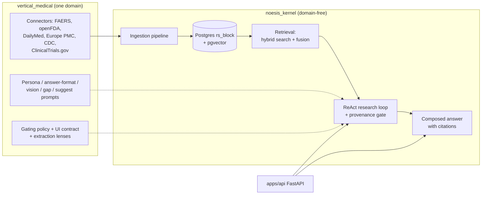

# Understanding Noesis

> A guided tour of the Noesis platform and its Medical vertical, written for a
> bright CS undergrad who has never seen this codebase. Every significant claim
> points at real code as `file:line` so you can go read the source yourself.

## What Noesis is (in three paragraphs)

**Noesis is a vertical-agnostic, evidence-grounded AI research platform.** You
ask it a natural-language question ("Does metformin reduce cardiovascular
mortality in type 2 diabetes?") and it returns a written answer where *every*
sentence is traceable to a real document it actually retrieved. It is not a
chatbot that "knows things" — it is a research engine that *finds* things, quotes
them verbatim, verifies the quotes exist, and only then writes prose. The
architecture splits cleanly into a **domain-free kernel**
(`packages/kernel/noesis_kernel/`) that knows nothing about medicine, law, or
finance, and a **vertical** (`packages/vertical_medical/`) that teaches the
kernel one domain by supplying data connectors, prompts, and UI declarations.
Medicine is the active vertical; the kernel stays domain-free so another vertical
could plug in without touching it.

**The big idea is a strict division of ownership: the LLM owns MEANING, code owns
STRUCTURE and PROVENANCE.** Any judgment that requires understanding — "is this
evidence relevant?", "what does this study conclude?", "which claims answer the
question?" — is delegated entirely to the language model. But anything the model
could *fabricate* is checked by deterministic code. The centerpiece is the
**provenance hard gate** (`research/provenance.py:44`): before a claim is allowed
into an answer, the model must supply a verbatim `quote`, and code verifies that
that exact string physically exists in the block the model cited. If it doesn't,
the claim is thrown away — no exceptions, no "close enough." This is why Noesis
structurally *cannot* hallucinate a citation: a fabricated quote fails a substring
check and never reaches the reader.

**Everything else in the system exists to make that core loop recall-complete,
honest, and affordable.** Evidence gets *into* the system through an ingestion
pipeline (connectors → parse → block → embed → index into Postgres) tagged with
generic "facets" so the kernel never learns a domain word. Questions get
*answered* by a **ReAct loop** (`research/react.py`) that alternates searching and
reasoning, runs the provenance gate on every claim, recovers when the model
abstains, falls back to a second model when the first one is shy, optionally
mines every retrieved passage for more claims, ranks the survivors by relevance,
and finally composes a "living answer" with inline `[n]` citations. A per-run
budget governor caps spend; an honesty signal makes the model confess when its
evidence is only tangential. The result is a platform where the answer is not
just plausible — it is *checkable*, sentence by sentence.

## The mental model

The kernel is a set of Lego bricks with standard-shaped connectors (Python
`Protocol`s in `contract/protocols.py`). A vertical is a box of domain-shaped
Lego pieces that snap into those connectors. The app (`apps/api/app.py`) is the
baseplate that discovers which box is installed and wires everything together at
startup. Add a whole new domain (say, legislative research) by shipping a new box
— **zero kernel edits**.

## Table of contents

| Doc | What it covers |
|-----|----------------|
| [01-architecture.md](01-architecture.md) | The kernel/vertical split and *why*; the layer stack (contract → corpus/ingestion → retrieval → research → runtime → api); the core data model (Document / Block / BlockContent, `rs_block`, facets, Locator); a system diagram. |
| [02-ingestion.md](02-ingestion.md) | How evidence gets *into* the corpus: connectors, the discover→fetch→parse→block→embed pipeline, `materialize_to_postgres`, facets (`source_kind`, `source_country`), content-addressed dedup, and the prod-direct gap-fill queue. Plus every medical connector and what it covers. |
| [03-answering-questions.md](03-answering-questions.md) | The heart: the ReAct loop step by step, the provenance hard gate, abstention recovery, the second-model fallback grounder, claims-first extraction, evidence selection, and compose. The budget governor and the honesty signal. |
| [04-medical-vertical.md](04-medical-vertical.md) | How the medical vertical customizes the kernel: persona, answer-format, vision, gap/suggest prompts, gating, extraction lenses, source-URL linking, the connectors, and why medical evidence needs strict grounding. |
| [05-design-philosophy.md](05-design-philosophy.md) | The *why*: the operating rules that shaped it (LLM owns meaning; provenance ≠ correctness; grounding as a hard gate; fail-safe over guessing; flags default-off; held-out evals; cost discipline) and the core tradeoffs. |
| [06-improvements.md](06-improvements.md) | Every knob and its effect; the recall/precision/cost tradeoffs; known gaps and limitations; concrete improvement ideas with rationale. |

## A note on accuracy

These docs were written by reading the code directly, and are pinned to a
specific state of the repo (latest commit at time of writing:
`a53cc3a feat(admin): /admin/coverage reports by_country block distribution`).
Line numbers drift as code changes — treat them as "look near here," and trust
the code over the prose if they ever disagree. Where the code surprised us or
contradicted a first-glance summary, we say so explicitly (see the "Surprises"
callouts).
